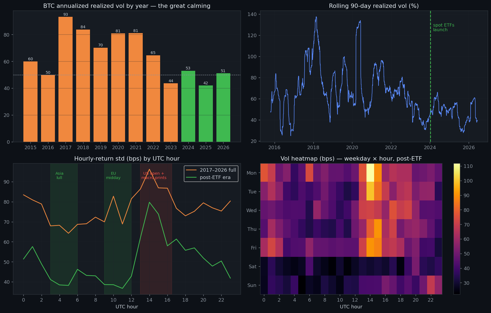

# BTC Volatility Through Time — 2011 → 2026
### The research behind the dashboard's "Trading Clock"

**Data:** Coinbase daily candles 2015-07 → 2026-06 (3,981 days) + Binance hourly candles 2017-08 → 2026-06 (77,182 hours), both fetched live from free public APIs on 2026-06-12. The 2011–2014 era predates reliable exchange APIs; published figures put annualized vol at 150–400 % in those years (Mt. Gox era), even wilder than anything below.



---

## 1. The Great Calming — yearly realized vol

| Year | RV % | Year | RV % |
|------|------|------|------|
| 2015 | 60.0 | 2021 | 81.1 |
| 2016 | 49.9 | 2022 | 64.6 |
| 2017 | 93.1 | 2023 | 43.6 |
| 2018 | 83.7 | **2024 (ETF)** | **53.0** |
| 2019 | 70.2 | 2025 | 41.9 |
| 2020 | 80.8 | 2026 YTD | 51.1 |

Your instinct is **confirmed by the data**: pre-ETF (2020 → Jan 2024) realized vol averaged **69.3 %**; since the spot ETFs launched on 2024-01-11 it is **48.3 %** — a ~30 % structural compression. ETF arbitrage desks, basis traders and systematic vol sellers now absorb flow that used to gap the price. BTC is maturing from a lottery ticket toward a macro asset — but it is *still* ~3× S&P 500 vol, so "calm" is relative.

**What this means for an option seller:** premiums are smaller than the legends of 2017/2021, but vol *spikes* still revert faster and from lower peaks — the sell-the-spike trade has become statistically friendlier, while the buy-and-pray long straddle has become harder.

## 2. The Trading Clock — hour-of-day (UTC), post-ETF era

Hourly-return std in basis points (higher = louder):

```
quiet   03–05 UTC   38–41 bps   Asia lunch → Europe pre-open lull
quiet   09–11 UTC   37–39 bps   Europe midday drift
LOUD    13–16 UTC   58–80 bps   US pre-market + cash open + macro prints
medium  17–23 UTC   42–61 bps   US afternoon, fades into Asia
```

The 14:00 UTC hour (**80 bps**) is more than **twice** as volatile as 05:00 or 11:00 UTC (**38 bps**). Why: US CPI/PPI/NFP print at 12:30 UTC, NYSE opens 13:30 UTC, FOMC statements land 18:00 UTC. BTC has *synchronized with the US macro calendar* — strong evidence of institutionalization.

### Straddle playbook by clock
- **SELL premium / harvest theta:** enter short straddles or strangles into the **02:00–05:00 UTC** window or **Friday after US close (21:00 UTC)** going into the weekend. Decay accrues while the market statistically does the least.
- **BUY straddles:** position **before 12:30–14:30 UTC on US data days** (CPI, NFP, FOMC). That's where the big candles live. Buying a straddle at 10:00 UTC on CPI day = paying quiet-hours prices for loud-hours movement.

## 3. Day-of-week

| Day | Daily-ret RV % (2015-26) | Hourly bps (post-ETF) |
|-----|--------------------------|------------------------|
| Mon | 73.7 | 61.6 |
| Tue | 66.6 | 56.0 |
| Wed | 71.0 | 53.8 |
| Thu | **83.9** | 52.9 |
| Fri | 68.1 | 57.0 |
| **Sat** | **51.1** | **31.9** |
| Sun | 53.0 | 39.9 |

**Weekends run at 64 % of weekday vol** (post-ETF it's even starker: Saturday is barely half a weekday). The classic crypto income trade — **sell Friday-evening straddles, buy them back Sunday night / Monday open** — is alive and well, *but* respect the tail: several of history's worst candles (incl. COVID-adjacent moves) printed on thin weekend books. Always run it with the dashboard's Risk Gate GREEN and defined exits.

Thursday is the loudest day on daily closes (US data clustering + weekly options expiry positioning) — a good *long*-straddle day when IV is cheap.

## 4. Month-of-year

| Month | RV % | Month | RV % |
|-------|------|-------|------|
| Jan | 73.7 | Jul | 65.9 |
| Feb | 72.6 | Aug | 58.0 |
| **Mar** | **87.9** | Sep | 56.5 |
| Apr | 56.5 | **Oct** | **47.7** |
| May | 67.9 | Nov | 71.1 |
| Jun | 74.9 | Dec | 69.7 |

**October is historically the calmest month** (47.7 %) — prime theta-harvest season ("Uptober" tends to grind, not gap). **March is the wildest** (87.9 % — COVID crash, banking crisis 2023, halving-run frenzies), with Nov–Jan elevated by year-end flows. Seasonality is a tilt, not a law — size accordingly.

## 5. Vol clustering — the regime is sticky

P(quiet day | quiet day) = **0.56**, P(volatile day | volatile day) = **0.56**. Calm begets calm, storm begets storm. Practical rule: **don't sell the first quiet day after a storm; don't buy straddles on the third quiet week.** The dashboard's IV/HV gate already encodes this — this study explains *why* it works.

## 6. Where we are right now (2026-06-12)

30-day realized vol = **42.2 %**, the **43rd percentile** of the post-ETF era — mid-range, neither a vol-seller's feast nor famine. Combined with today's RED risk gate (Kronos vol-amp 93 %, Extreme Fear 12, heavy put skew), the clock says: wait for the storm to pass, then harvest the elevated IV it leaves behind.

## 7. Your unspoken words — what else the data whispers

1. **"When is theta actually mine?"** Theta is only collected when realized < implied. The weekend (64 % ratio) is the one *structural* window where implied (priced ~flat across days) systematically overpays realized. That's the closest thing to a free lunch in this market.
2. **"Big money changed the game."** Yes — and it moved the action to *US hours*. The old "Asia pumps" pattern is dead; the heatmap shows the loudest cells are Mon–Fri 13–16 UTC. Trade the US calendar, sleep through Asia.
3. **Event risk is now schedulable.** CPI/FOMC/NFP dates are public months ahead. A retail trader with a macro calendar can avoid selling into the exact 4-hour windows that produce most of the month's tail risk — that alone removes maybe half of straddle-selling blowups.
4. **The halving cycle is fading.** 2017: 93 % → 2021: 81 % → 2025: 42 %. Each cycle's vol peak is lower. Expect future "bull years" to feel slower; price targets built on 2017 behavior will disappoint, premium-selling strategies will compound instead.
5. **Skew is the tell.** Today's 50 % put-IV vs 33 % call-IV says the market pays up for crash protection. When skew is that lopsided, selling the *put* side alone (cash-secured or spread) earns most of the strangle's credit with half the directional regret — the desk's strangle builder shows you both legs so you can see it.

*Educational research, not financial advice. Past seasonality does not guarantee future patterns.*
