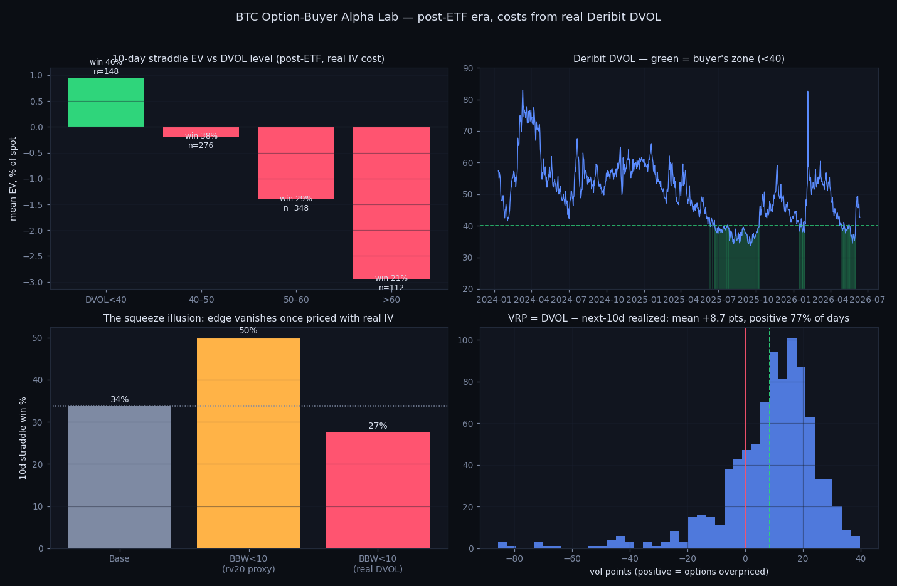

# Option-Buyer Alpha — what actually survives real option prices
### The research behind the dashboard's "Buyer's Radar"

**Data:** Coinbase daily 2015→2026 (3,981 days), Binance hourly 2017→2026, and — critically — **Deribit DVOL** (BTC 30-day implied vol index), 1,000 daily closes 2023-09→2026-06. All free public APIs, fetched 2026-06-12. Validation era: post-ETF (2024-01-11 onward, 884 days). Straddle cost modeled as 0.8 × (DVOL/100) × √(h/365) of spot — i.e. what the market *actually charges*, not a realized-vol guess.

---

## 0. The most important finding is a confession

Our first pass (priced with a realized-vol proxy) said: *Bollinger-Band squeeze → buy straddles, win rate jumps from 40% to 50–53%.* It looked beautiful. Then we re-priced every trade with **real implied vol (DVOL)** and the edge **vanished — and reversed**:

| Signal | Win % (rv20 proxy cost) | Win % (real DVOL cost) | Base |
|---|---|---|---|
| BBW squeeze <10th pctile, 10d | **50.0%** | **27.4%** (p=0.93) | 33.7% |
| Squeeze + cheap-IV-percentile combo | — | 21.6% | 33.7% |

Why? During a squeeze, *realized* vol is depressed, so the proxy made options look cheap. But the options market is not fooled: DVOL only dips to ~47 vs ~51 average during squeezes — dealers keep implied vol elevated precisely because they know squeezes resolve violently. **The "edge" lived in our cost model, not in the market.** Any backtest of option buying that prices premium off realized vol will manufacture this same illusion. We are publishing the failure because a tool that hides its dead ends will eventually hide yours.

## 1. The structural headwind: buyers pay a standing tax

Post-ETF, the **variance risk premium** (DVOL minus next-10-day realized vol) averages **+8.7 vol points and is positive on 77% of days**. Unconditional straddle buying loses on average:

| Horizon | Win % | Mean EV | Median EV |
|---|---|---|---|
| 3d | 34.7% | −0.48% | −1.07% |
| 5d | 35.0% | −0.68% | −1.52% |
| 10d | 33.7% | −0.83% | −1.81% |

Median is worse than mean → the buyer bleeds steadily and gets paid back in rare fat tails. This is why the dashboard's default stance is *selling* with a risk gate. A buyer needs a *condition*, not a habit.

## 2. The one condition that works: absolute DVOL below ~40

Not DVOL *percentile* — DVOL *level*. When the market prices BTC like a calm large-cap (DVOL < 40), it systematically undercharges for what BTC still does:

| Entry | n | 10d win % | 10d mean EV | Bootstrap p |
|---|---|---|---|---|
| DVOL < 38 | 75 | 46.7% | **+1.17%** | — |
| **DVOL < 40** | 148 | **45.9%** | **+0.95%** | **0.0001** |
| DVOL < 42 | 185 | 43.2% | +0.73% | — |
| DVOL < 44 | 238 | 39.5% | +0.50% | — |
| DVOL 50–60 | 348 | 29.3% | −1.41% | — |
| DVOL > 60 | 112 | 21.4% | **−2.94%** | — |

The relationship is **monotone**: every step cheaper in implied vol improves the buyer's odds; every step richer worsens them. Interpretation: BTC has a *vol floor*. Implied vol in the low 30s/high 30s assumes a calm that BTC's microstructure (24/7, leveraged, reflexive) cannot sustain for long — so cheap straddles are mispriced insurance. Conversely, **DVOL > 60 is a buyer's graveyard** (−2.94%/trade): by the time vol is screaming, you are buying the top of the fear premium.

**Honest caveats:** (a) windows overlap — the 148 signal days are ~8 distinct calm episodes, mostly mid-2025 → mid-2026; non-overlapping resample (n=15) still shows +0.39% EV, win 47%. (b) DVOL history is only ~2.7 years. (c) This is a *regime* edge, not a daily timing trigger — when the zone is on, it tends to stay on for weeks.

## 3. The secondary condition: shock-day continuation

Enter at the close of a **shock day** (|daily move| > 2.5× trailing 20-day vol): 5-day straddle win **43.2% vs 35.0%** base, EV **+0.34%**, bootstrap **p = 0.044** (n=37). Vol clusters — the first explosion is usually not the last. This survives real IV costs because dealers re-mark vol *after* the move with a lag of hours, not instantly to the new regime. Small edge, small n — treat as a tilt, never a system.

## 4. Direction: still mostly unforecastable

Squeeze→Donchian-breakout direction trades, post-ETF: up-breakout 10d hit rate 50%, down-breakout 50%. Coin-flips. The pre-ETF "momentum breakout" drift (+2.28%/10d) decayed to +0.33% post-ETF — the ETF arb complex eats trends faster now. **Buy straddles/strangles for the *move*; don't pay for a directional opinion the data can't support.** If you must lean, the one defensible lean is the *skew tell* from the seller study: when put IV is 15+ points over call IV, the crowd has already paid for the crash — fading panic with call-side structures has the better entry price (not a backtested system; a pricing observation).

## 5. The buyer's playbook (what the dashboard now automates)

1. **GREEN (buy zone):** DVOL < 40. Buy 7–14-day ATM straddles or 25Δ strangles, sized small, held to move or expiry. This is the only *positive-EV* standing condition found.
2. **AMBER (event tilt):** DVOL 40–50 **and** a scheduled macro print inside your horizon (CPI/NFP 12:30 UTC, FOMC 18:00 UTC) **or** a shock day just closed. EV ≈ flat; only take it with a reason.
3. **RED (don't pay up):** DVOL > 50, and especially > 60. The fear premium is the seller's harvest, not the buyer's lottery ticket. The squeeze pattern, three-quiet-days, and "feels coiled" intuitions are all **already in the price** — verified above.
4. **Timing within the day:** from the Trading Clock study — enter longs *before* 12:30–14:30 UTC on US data days; never initiate long premium into the 02:00–05:00 UTC dead zone or Friday 21:00 UTC weekend bleed where theta is the only thing moving.

**Today (2026-06-12):** DVOL 42.5 (35th percentile), BBW 95th percentile (post-storm, not coiled), price 63.4k mid-channel, risk gate RED. Verdict for buyers: *close but not in the zone* — DVOL must lose another ~3 points before long premium is statistically paid for.

*Educational research, not financial advice. All edges are small, regime-dependent, and can decay — as Section 0 proves we will tell you when they do.*
