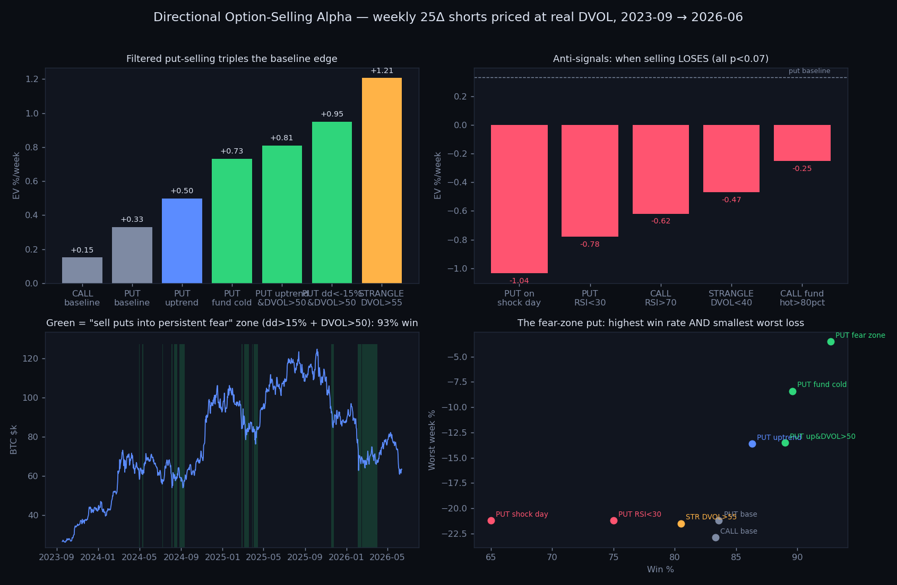

# Directional Option-Selling Alpha — where the seller's real money lives
### The research behind the dashboard's "Seller's Compass"

**Data:** Coinbase daily 2015→2026, Binance funding-rate history 2019-09→2026-06 (7,402 8-hour records → 2,468 daily sums), Deribit DVOL 2023-09→2026-06 (1,000 daily closes). Engine: every day we "sell" a 7-day 25Δ put and/or call priced by Black-Scholes **at that day's real DVOL** (not a realized-vol guess — see the buyer study's Section 0 for why that matters), held to expiry, P&L as % of spot. 894 tradable days. Bootstrap = 10,000 resamples; non-overlap = entries forced ≥7 days apart so windows don't share fate.

---

## 0. The honest headline first

You asked: *"selling has a lot of alpha if you get the direction correctly."* Half true, and the half matters:

- **The directional edge exists almost entirely on the PUT side.** Every put filter below is significant. The mirror-image call trade — sell calls in a downtrend — earns +0.27%/wk but fails the bootstrap (**p = 0.18**, could be luck). BTC's drift, the variance premium, and put-skew all push the same way: *the market overpays for crash protection far more reliably than it overpays for rally protection.* A directional seller is, in practice, a put seller who knows when to stand down.
- Getting direction right is **not** prediction. None of the winning filters forecast where BTC goes next week (the buyer study showed breakout direction is a coin-flip). They identify days when the *price of fear* is too high relative to the *persistence of fear*. That's a pricing edge, not a crystal ball — and it's the only kind that survived testing.

## 1. Baselines — the unconditional tax collection

| Strategy (always on) | n | EV /wk | Win % | Worst wk | CVaR5 |
|---|---|---|---|---|---|
| Sell 25Δ put | 894 | +0.33% | 83.6% | −21.2% | −7.8% |
| Sell 25Δ call | 894 | +0.15% | 83.3% | −22.9% | −9.0% |
| Sell 25Δ strangle | 894 | +0.48% | 74.8% | −21.5% | −10.3% |

Both sides win 83% of weeks, but the put collects **2.2× the call's EV** for the same delta. That asymmetry is the skew premium plus drift, and it's the foundation everything below builds on.

## 2. The four validated put-selling regimes

| Filter | n (episodes) | EV /wk | Win % | Worst | Bootstrap p | Non-overlap EV |
|---|---|---|---|---|---|---|
| **Persistent fear:** drawdown >15% off 90d high **and** DVOL >50 | 151 (~10) | **+0.95%** | **92.7%** | **−3.5%** | **0.0000** | +0.86% |
| **Paid twice:** close > MA100 **and** DVOL >50 | 301 | +0.81% | 89.0% | −13.5% | 0.0000 | +0.76% |
| **Washed-out positioning:** 7d funding < 0 | 111 | +0.81% | 90.1% | −5.0% | 0.004 | +0.69% |
| **Cool crowd:** funding < 20th pctile (180d) | 259 (~13) | +0.73% | 89.6% | −8.4% | 0.0005 | +0.65% |
| (reference) uptrend alone | 526 | +0.50% | 86.3% | −13.6% | 0.035 | +0.49% |

**The standout is the "persistent fear" trade** — and look at the *worst week*: −3.5%, versus −21% for the unconditional seller. It doesn't just earn 3× the baseline; it earns it with a tenth of the tail. At 14 days the same filter gets even better: +1.57%/2wk, **96.7% win, worst −3.1%**. Why it works: by the time BTC has been down >15% for a while *and* implied vol is still >50, the crash already happened — sellers of puts there are selling insurance on a house that already burned, at fire-insurance prices. The leveraged longs who could have forced liquidation cascades are already gone (which is also why the funding filters agree — they measure the same flush from the positioning side).

The funding finding is genuinely counterintuitive and worth a paragraph: **sell puts when funding is *cold*, not hot.** Intuition says negative funding = bearish crowd = dangerous to sell puts. The data says the opposite: negative funding means shorts are paying longs, leverage has been flushed, and the fuel for a liquidation cascade is spent. Worst week selling puts on negative funding: **−5.0%** across 7 years of funding data. Meanwhile funding >80th percentile is when the *call* seller gets killed (−0.25%/wk, p=0.06): hot funding = momentum that runs over rally-cappers.

## 3. The anti-signals — when "obvious" selling loses (all significant)

| Tempting trade | n | EV /wk | p | What actually happens |
|---|---|---|---|---|
| Sell puts the day of a crash (shock day) | 20 | **−1.04%** | 0.015 | Vol clusters; the first explosion isn't the last. *Wait* for fear to become persistent (Section 2 row 1). |
| Sell puts at RSI < 30 | 84 | −0.78% | 0.0002 | "Oversold" keeps falling for a week. RSI extremes are continuation, not reversal, at 7-day horizon. |
| Sell calls at RSI > 70 | 157 | −0.62% | 0.0007 | Same in mirror: capping a hot rally is donating to momentum. |
| Sell strangles at DVOL < 40 | 148 | −0.47% | 0.0007 | Perfect symmetry with the buyer study: DVOL<40 is the **buyer's** zone. Cheap vol is cheap for a bad reason. |
| Sell calls when funding > 80th pctile | 116 | −0.25% | 0.06 | Crowded longs blow through strikes before they liquidate. |

The pattern: **never sell into fresh momentum or fresh panic; sell into exhausted fear.** Same event, different week. Timing within the fear cycle *is* the edge.

## 4. The Seller's Compass (what the dashboard now automates)

1. **PRIME (rare, ~17% of days):** drawdown >15% + DVOL >50 → sell 7–14d 25Δ puts. Historically 93–97% win, worst week −3.5%. The single best risk-adjusted trade we found anywhere in this entire research program.
2. **GOOD:** uptrend (>MA100) with DVOL >50, **or** funding negative / <20th percentile → sell 7d 25Δ puts. ~+0.7–0.8%/wk.
3. **NEUTRAL:** uptrend, normal vol → baseline put selling earns the standing premium (+0.5%); the strangle at DVOL >55 is the better harvest (+1.21%/wk, p=0.0000) but takes the fat left tail back.
4. **STAND ASIDE:** shock day just printed, RSI pinned <30 or >70, or DVOL <40. Every one of these is a *significant loser* for sellers. DVOL<40 hands the baton to the Buyer's Radar.
5. **Call side:** only as the second leg of a strangle in high vol. As a standalone directional trade it has no validated edge — we looked.

## 5. Caveats a 60-year desk would insist on

- **Skew works in your favor here.** We priced puts at flat DVOL; real Deribit 25Δ puts trade *above* index vol. Real-world put-selling credit is richer than modeled — our EVs are conservative on the put side, optimistic on the call side (one more reason the call edge shouldn't be trusted).
- **DVOL history is 2.7 years** (~10 fear episodes, ~13 cold-funding episodes). The funding filters were cross-checked over the full 7-year funding history. No 2018- or 2022-style 80% bear market lives inside the DVOL sample; in such a regime "persistent fear" entries would stack losses longer than this table shows. Size as if the table is too kind, because it might be.
- **Kronos is a live overlay, not a backtested one.** There is no historical archive of Kronos forecasts, so its upside-probability can't be backtested honestly. The dashboard uses it as a *tiebreaker* on top of the validated filters (e.g. PRIME + Kronos-bullish = full size; PRIME + Kronos-bearish = half size), and it is labeled as such.
- Execution on Delta Exchange: lot size 0.001 BTC, check their margin calculator; these EVs are before fees/slippage (~0.02–0.05% round trip at typical spreads).

*Educational research, not financial advice. The fear-zone trade fails catastrophically exactly once per cycle — size every position so that week is survivable.*
