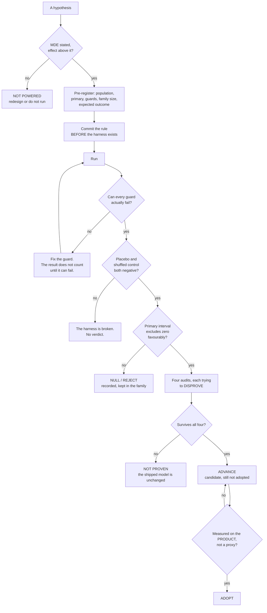
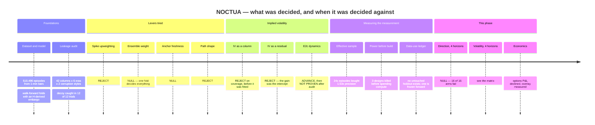

# NOCTUA — volatility and probabilistic direction
*Educational research. Not financial advice. Generated by `python -m model.research.report`; every table is read from an artifact rather than transcribed.*

## Executive summary

The honest headline is that **the shipped model is unchanged by any of this**, and that the phase's two largest results are a measured absence and a boundary.

- **Direction is closed at all four horizons (1h, 6h, 24h, 168h).** 8 of 8 model arms fail their pre-registered rule. The paired per-episode interval excludes zero on the *adverse* side — the arm is worse than the calibration-window base rate — in 5 of 8 rows and straddles zero in 3, at n up to 49,124 per horizon. Both negative controls behave. This is a measured absence, not an underpowered one.
- **The volatility matrix**, one NOCTUA arm per horizon against the mandatory baseline family: **1h** vs `persistence` — `noctua` fails (-0.04578), `noctua40` fails (+0.00328); **6h** vs `har_short` — `noctua` fails (-0.03197), `noctua40` fails (-0.01387); **24h** vs `har_short` — `noctua` fails (-0.00705), `noctua40` fails (-0.05026); **168h** vs `har_short` — `noctua` not evaluable, `noctua40` fails (-0.02362). 0 row(s) clear the pre-registered interval. Baselines refitted **per horizon**, so they know the horizon NOCTUA knows. Under the earlier horizon-blind fits NOCTUA cleared at H = 24 and H = 168; neither survives, and at H = 168 the pooled baseline had been costing itself a factor of 2.06.
- **The production headline survives its own comparison and fails a better one.** Against the arm it is published against it is +4.56% and clears; against `har_short` — a baseline that was already in `noctua/baselines.py` and had never been scored — it is +3.10% and does not. Twice in this phase the strongest available baseline turned out to already exist here and to be missing from the arm list.
- **An options P&L cannot be produced honestly here and is not produced.** What replaces it is a volatility-targeting overlay whose primary endpoint is risk control rather than return.

Three things found by guards rather than by looking:

- A comment in the direction benchmark said only one feature column depended on
  the horizon. **Five do.** The benchmark was re-run from corrected features
  rather than defended — a null produced with degraded inputs is not a null.
- The default bootstrap block length is a rule of thumb about *sample size* and
  knows nothing about the *overlap* it exists to absorb. At the weekly horizon
  it was about a fifth of the shared window. Every interval here uses a block
  of at least twice the forward window, and the narrower one is reported beside
  it.
- The research ledger's schema was enforced on one write path only. Checking
  the file instead found a dangling supersede pointer and a one-sided link.
  Both are now gated in CI.

## Assumptions this rests on

1. **Realized volatility from 5-minute returns is the target**, not an
   unobservable. Every arm is scored against the same estimator, so a bias in
   it cancels in the comparison — but the *level* of any QLIKE figure inherits
   it.
2. **QLIKE is the loss.** It is asymmetric: at a factor-2 error, under-forecast
   is penalised 1.60× more than over-forecast, and it is minimised by the
   conditional **mean** of variance, not the median. The shipped model reports
   a median, which is a known and unresolved mismatch (`E-scale`, still open).
3. **Walk-forward folds with an H-derived embargo** are the evaluation.
   Consecutive episodes overlap by construction, so all intervals are
   moving-block bootstraps and the block is at least twice the forward window.
4. **The trading costs in the economic section are assumptions, not
   measurements.** No order book, no fee schedule. Three levels are reported
   and a ranking that changes across them is declared cost-dependent.
5. **No untouched historical holdout exists.** Every calendar year has
   influenced training, calibration, feature selection, model selection or
   experiment design. This is documented year by year in
   `research/DATA_USE.md`, and the only honest remedy — a forward holdout
   frozen 2026-08-28 — is stated there with the uncomfortable part included:
   at roughly one independent regime per year, resolving a 6% effect on
   fold-level inference needs years, not weeks.
6. **The shipped model has not changed at any point in this work.** Nothing in
   this report is an adoption.

## Volatility: the four-horizon matrix

Every OLS baseline here is refitted **per horizon** and `log_har_cal` is in the arm list. That matters: the first version of this matrix fitted the baselines once on the pooled sample spanning all four horizons, so they carried no horizon term while NOCTUA sees `cal_H`. The `_pooled` arms below are those horizon-blind fits, kept so the size of the confound is a number rather than an argument — at H = 168 the pooled fit costs the baseline a factor of **2.06**.

Under the horizon-blind baselines NOCTUA cleared at H = 24 (+0.03032) and H = 168 (+0.14462). **Neither survives here.** That reversal is the result, and it was pre-registered as the outcome I should be prepared for.

Every arm at a given horizon is scored on the **same episodes**, with the same target and the same loss. The baseline to beat is chosen on the **calibration** slice and never on test; a `_pooled` arm is never eligible to be chosen.
Bonferroni within this family: 4 rows, so intervals are at 98.75%. Seeds: 3.

### H = 1h — 49,123 test episodes, folds [2021, 2022, 2023, 2024, 2025, 2026]
Best baseline by calibration QLIKE: **persistence** persistence 0.6253 · log_har_cal 0.8245 · log_har 0.8471 · har_short 1.4016

| arm | QLIKE | vs best | worst fold | spike | calm | paired CI (blocks) | same at n^(1/3)? |
|---|---:|---:|---:|---:|---:|---|---|
| `noctua` | 0.67177 | -0.04578 | 0.89095 | 6.1280 | 0.3844 | [-0.06741, -0.02639] (37) | yes |
| `noctua40` | 0.62271 | +0.00328 | 0.81180 | 5.4345 | 0.3693 | [-0.01593, +0.02032] (37) | yes |
| `garch_normal` | 0.60326 | +0.02273 | 0.83662 | 2.4328 | 0.5069 | [+0.00270, +0.04462] (37) | — |
| `garch_t` | 0.57438 | +0.05161 | 0.77850 | 2.9651 | 0.4485 | [+0.03425, +0.07075] (37) | — |
| `har_short` | 1.03094 | -0.40495 | 2.83480 | 12.4521 | 0.4293 | [-1.53504, +0.01882] (37) | — |
| `har_short_pooled` | 0.54040 | +0.08559 | 0.69487 | 4.0822 | 0.3538 | [+0.03327, +0.11310] (37) | — |
| `log_har` | 0.82435 | -0.19836 | 1.03734 | 7.3522 | 0.4805 | [-0.22635, -0.17356] (37) | — |
| `log_har_cal` | 0.80615 | -0.18016 | 1.02092 | 7.2275 | 0.4679 | [-0.20768, -0.15612] (37) | — |
| `log_har_cal_pooled` | 0.66372 | -0.03773 | 0.82924 | 5.6422 | 0.4015 | [-0.06048, -0.01811] (37) | — |
| `log_har_pooled` | 0.63452 | -0.00853 | 0.81143 | 4.8646 | 0.4117 | [-0.02663, +0.00751] (37) | — |
| `persistence` | 0.62599 | +0.00000 | 0.85656 | 3.9366 | 0.4516 | — (is the baseline) | — |

Pre-registered verdict: **noctua** DOES NOT CLEAR · **noctua40** DOES NOT CLEAR

### H = 6h — 49,124 test episodes, folds [2021, 2022, 2023, 2024, 2025, 2026]
Best baseline by calibration QLIKE: **har_short** har_short 0.4376 · persistence 0.4611 · log_har_cal 0.4645 · log_har 0.4852

| arm | QLIKE | vs best | worst fold | spike | calm | paired CI (blocks) | same at n^(1/3)? |
|---|---:|---:|---:|---:|---:|---|---|
| `noctua` | 0.44907 | -0.03197 | 0.61072 | 3.4801 | 0.2895 | [-0.05017, -0.01162] (37) | yes |
| `noctua40` | 0.43097 | -0.01387 | 0.55961 | 3.3921 | 0.2751 | [-0.02989, +0.00588] (37) | yes |
| `garch_normal` | 0.42058 | -0.00348 | 0.59734 | 1.4500 | 0.3664 | [-0.03150, +0.03066] (37) | — |
| `garch_t` | 0.41246 | +0.00463 | 0.56003 | 1.7940 | 0.3397 | [-0.02046, +0.03628] (37) | — |
| `har_short` | 0.41710 | +0.00000 | 0.55477 | 2.9832 | 0.2820 | — (is the baseline) | — |
| `har_short_pooled` | 0.38328 | +0.03382 | 0.50414 | 2.6956 | 0.2615 | [+0.02607, +0.04273] (37) | — |
| `log_har` | 0.46795 | -0.05085 | 0.60586 | 3.4055 | 0.3133 | [-0.06828, -0.03048] (37) | — |
| `log_har_cal` | 0.44971 | -0.03261 | 0.58993 | 3.3182 | 0.2987 | [-0.04968, -0.01216] (37) | — |
| `log_har_cal_pooled` | 0.45871 | -0.04161 | 0.56916 | 3.5879 | 0.2940 | [-0.06086, -0.01965] (37) | — |
| `log_har_pooled` | 0.43100 | -0.01390 | 0.55137 | 3.1177 | 0.2895 | [-0.02935, +0.00620] (37) | — |
| `persistence` | 0.45301 | -0.03591 | 0.64645 | 2.3776 | 0.3517 | [-0.05468, -0.01288] (37) | — |

Pre-registered verdict: **noctua** DOES NOT CLEAR · **noctua40** DOES NOT CLEAR

### H = 24h — 49,106 test episodes, folds [2021, 2022, 2023, 2024, 2025, 2026]
Best baseline by calibration QLIKE: **har_short** har_short 0.3016 · log_har_cal 0.3148 · log_har 0.3338 · persistence 0.4885

| arm | QLIKE | vs best | worst fold | spike | calm | paired CI (blocks) | same at n^(1/3)? |
|---|---:|---:|---:|---:|---:|---|---|
| `noctua` | 0.28523 | -0.00705 | 0.41651 | 1.9655 | 0.1967 | [-0.02288, +0.00472] (48) | yes |
| `noctua40` | 0.32844 | -0.05026 | 0.41870 | 2.4113 | 0.2187 | [-0.06937, -0.03445] (48) | yes |
| `garch_normal` | 0.32684 | -0.04866 | 0.45164 | 0.8884 | 0.2973 | [-0.07682, -0.01687] (48) | — |
| `garch_t` | 0.30417 | -0.02598 | 0.38892 | 1.1555 | 0.2593 | [-0.04686, -0.00120] (48) | — |
| `har_short` | 0.27818 | +0.00000 | 0.36465 | 1.8184 | 0.1971 | — (is the baseline) | — |
| `har_short_pooled` | 0.31555 | -0.03737 | 0.40267 | 2.0454 | 0.2244 | [-0.04620, -0.02962] (48) | — |
| `log_har` | 0.30630 | -0.02812 | 0.39094 | 2.1030 | 0.2117 | [-0.03761, -0.01993] (48) | — |
| `log_har_cal` | 0.28795 | -0.00977 | 0.37440 | 2.0274 | 0.1963 | [-0.01820, -0.00190] (48) | — |
| `log_har_cal_pooled` | 0.35523 | -0.07704 | 0.43322 | 2.5958 | 0.2372 | [-0.09817, -0.05899] (48) | — |
| `log_har_pooled` | 0.34416 | -0.06598 | 0.42505 | 2.4065 | 0.2355 | [-0.08363, -0.05114] (48) | — |
| `persistence` | 0.45511 | -0.17693 | 0.70438 | 2.1043 | 0.3682 | [-0.23689, -0.13309] (48) | — |

Pre-registered verdict: **noctua** DOES NOT CLEAR · **noctua40** DOES NOT CLEAR

### H = 168h — 48,962 test episodes, folds [2021, 2022, 2023, 2024, 2025, 2026]
Best baseline by calibration QLIKE: **har_short** har_short 0.1717 · log_har 0.1743 · log_har_cal 0.1743 · persistence 0.6509

| arm | QLIKE | vs best | worst fold | spike | calm | paired CI (blocks) | same at n^(1/3)? |
|---|---:|---:|---:|---:|---:|---|---|
| `noctua40` | 0.20569 | -0.02362 | 0.27789 | 1.0790 | 0.1597 | [-0.04914, -0.00588] (336) | yes |
| `garch_normal` | 0.53821 | -0.35613 | 0.75314 | 0.1917 | 0.5565 | [-0.43810, -0.27297] (336) | — |
| `garch_t` | 0.44349 | -0.26142 | 0.71676 | 0.2723 | 0.4525 | [-0.33223, -0.18877] (336) | — |
| `har_short` | 0.18207 | +0.00000 | 0.25494 | 0.9821 | 0.1400 | — (is the baseline) | — |
| `har_short_pooled` | 0.37558 | -0.19351 | 0.52044 | 1.6917 | 0.3063 | [-0.27586, -0.13106] (336) | — |
| `log_har` | 0.18435 | -0.00228 | 0.25576 | 1.0132 | 0.1407 | [-0.00479, +0.00027] (336) | — |
| `log_har_cal` | 0.18435 | -0.00228 | 0.25576 | 1.0132 | 0.1407 | [-0.00479, +0.00027] (336) | — |
| `log_har_cal_pooled` | 0.23553 | -0.05346 | 0.32545 | 1.0125 | 0.1946 | [-0.09102, -0.02738] (336) | — |
| `log_har_pooled` | 0.35031 | -0.16823 | 0.45038 | 1.7401 | 0.2771 | [-0.24152, -0.11005] (336) | — |
| `persistence` | 0.61859 | -0.43651 | 1.17738 | 1.6351 | 0.5651 | [-0.64182, -0.29545] (336) | — |

Pre-registered verdict: **noctua** NOT EVALUABLE · **noctua40** DOES NOT CLEAR

The fold-level spread is carried in the artifact as `per_fold` and is **not** the primary. `vol-matrix-power` measured its minimum detectable effect at 5.21% / 11.76% / 31.68% / 65.48% of the persistence baseline at H = 1 / 6 / 24 / 168, against a 4.98% reference effect — one row marginal, three not powered. That was measured *before* the matrix was built, which is the only time the measurement is worth anything.

## Volatility: the production slice, against the best baseline

The production configuration is H = 19 anchored at 17:00 UTC. This table asks whether the published advantage survives the **strongest baseline this repository already contains**, with the bar chosen on the calibration slice and never on test.

2,046 test episodes over 6 folds. Bonferroni at family size 5 → 99% intervals, blocks of 38. Best baseline by calibration QLIKE: **har_short** · har_short 0.3163 · log_har_cal 0.3251 · log_har 0.3436 · persistence 0.4574

| arm | QLIKE | vs best | rel % | worst fold | paired CI |
|---|---:|---:|---:|---:|---|
| `noctua` | 0.29702 | +0.00951 | +3.10 | 0.43404 | [-0.00897, +0.02448] |
| `har_short` | 0.30654 | +0.00000 | +0.00 | 0.42764 | — (is the baseline) |
| `log_har` | 0.32015 | -0.01361 | -4.44 | 0.41551 | [-0.03238, +0.00250] |
| `log_har_cal` | 0.30442 | +0.00212 | +0.69 | 0.40223 | [-0.01640, +0.01867] |
| `log_har_cal_pooled` | 0.31122 | -0.00469 | -1.53 | 0.41862 | [-0.02359, +0.01152] |
| `log_har_pooled` | 0.33774 | -0.03120 | -10.18 | 0.44558 | [-0.05184, -0.01428] |
| `persistence` | 0.43547 | -0.12893 | -42.06 | 0.69888 | [-0.18843, -0.08505] |

**The incumbent claim is confirmed.** Against `log_har_cal_pooled` — the arm the published headline is actually measured against — NOCTUA is +0.01420 (+4.56%), CI [+0.00300, +0.02339], which clears.

**The primary fails anyway, for a different reason.** Against `har_short` — which extends Corsi's cascade downward with `har_1h` and `har_6h`, has been in `noctua/baselines.py` throughout, and had never been scored as a competitor — NOCTUA is +3.10% and **DOES NOT CLEAR**. The unadjusted 95% interval [-0.00436, +0.02114] straddles zero too, so this is not a multiple-testing artifact.

NOCTUA still posts the best pooled QLIKE of any arm here. It is simply not *significantly* better than the best baseline at this sample size.

## Direction as a probability forecast

The baseline is the **calibration-window base rate**, not 0.5. P(R>0) rises with horizon and moves between years, so beating a coin demonstrates nothing. Calibration slope and intercept are **pass conditions**; AUC is reported and is explicitly not one.

| H | arm | Brier | BSS vs calib | AUC | cal slope | cal int | paired CI | verdict |
|---|---|---:|---:|---:|---:|---:|---|---|
| 1 | `base_unc` | 0.25001 | +0.00025 | 0.4977 | +0.001 | +0.018 | [-0.000165, +0.000045] | — |
| 1 | `base_calib` | 0.25007 | +0.00000 | 0.5011 | +0.001 | +0.018 | — | — |
| 1 | `logistic` | 0.25093 | -0.00342 | 0.5090 | +0.052 | +0.015 | [+0.000328, +0.001464] | FAIL |
| 1 | `gbm` | 0.25046 | -0.00154 | 0.5148 | +0.052 | +0.016 | [-0.000068, +0.000888] | FAIL |
| 1 | `placebo` | 0.25353 | -0.01384 | 0.4992 | -0.004 | +0.019 | [+0.002304, +0.004869] | — |
| 1 | `shuffled` | 0.25065 | -0.00231 | 0.5026 | -0.044 | +0.020 | [+0.000203, +0.001127] | — |
| 6 | `base_unc` | 0.25007 | +0.00142 | 0.4902 | +0.001 | +0.030 | [-0.000896, +0.000161] | — |
| 6 | `base_calib` | 0.25042 | +0.00000 | 0.5036 | +0.003 | +0.030 | — | — |
| 6 | `logistic` | 0.25286 | -0.00972 | 0.5046 | +0.012 | +0.029 | [+0.001098, +0.003891] | FAIL |
| 6 | `gbm` | 0.25119 | -0.00306 | 0.5128 | +0.038 | +0.028 | [-0.000305, +0.001990] | FAIL |
| 6 | `placebo` | 0.25227 | -0.00737 | 0.4966 | +0.020 | +0.030 | [+0.000899, +0.002818] | — |
| 6 | `shuffled` | 0.25212 | -0.00678 | 0.5001 | +0.015 | +0.028 | [+0.000514, +0.003173] | — |
| 24 | `base_unc` | 0.25018 | +0.00796 | 0.4819 | -4.216 | +0.449 | [-0.004321, +0.000084] | — |
| 24 | `base_calib` | 0.25219 | +0.00000 | 0.4933 | -0.009 | +0.050 | — | — |
| 24 | `logistic` | 0.25906 | -0.02726 | 0.4993 | +0.004 | +0.049 | [+0.002969, +0.011136] | FAIL |
| 24 | `gbm` | 0.25608 | -0.01546 | 0.5116 | -0.000 | +0.049 | [+0.000707, +0.007498] | FAIL |
| 24 | `placebo` | 0.25731 | -0.02032 | 0.4965 | -0.035 | +0.058 | [+0.002185, +0.008549] | — |
| 24 | `shuffled` | 0.25584 | -0.01448 | 0.4979 | +0.005 | +0.049 | [+0.001191, +0.006553] | — |
| 168 | `base_unc` | 0.25046 | +0.02749 | 0.4609 | -5.349 | +0.815 | [-0.013279, -0.000996] | — |
| 168 | `base_calib` | 0.25754 | +0.00000 | 0.5045 | +0.055 | +0.064 | — | — |
| 168 | `logistic` | 0.26282 | -0.02053 | 0.5216 | +0.021 | +0.075 | [-0.001113, +0.011843] | FAIL |
| 168 | `gbm` | 0.28142 | -0.09271 | 0.5015 | -0.027 | +0.084 | [+0.013362, +0.035569] | FAIL |
| 168 | `placebo` | 0.26723 | -0.03762 | 0.5145 | +0.011 | +0.074 | [+0.002234, +0.017375] | — |
| 168 | `shuffled` | 0.25889 | -0.00523 | 0.5074 | +0.045 | +0.066 | [-0.000886, +0.003605] | — |

A **positive** paired CI means the arm is **worse** than the baseline: the quantity bootstrapped is arm-minus-baseline Brier.

## Economic validation, and its boundary

**There is no options P&L in this report and there will not be one.** `model/artifacts/datasources.json` records 18 probes and 2 reachable endpoints; every exchange API and aggregator returns 403 through the egress proxy. The only option-adjacent series on disk is the Deribit DVOL volatility *index* — a level, with no strikes, no expiries, no bid/ask, no size, no prints. An options P&L could only be simulated, and every assumption the simulation needed would do more work than the forecast being tested.

A directional backtest is also absent, for a different reason: the signal was measured to carry no information at n ≈ 49,000 per horizon, so its equity curve would be a random walk with a fee drag.

What *can* be measured is a **volatility-targeting overlay on spot BTC**, which is the actual use of a volatility forecast for anyone without an options book. Its primary endpoint is risk control — |realised annualised vol − target| — not return.

> **`econ_voltarget.json` is not present.** The overlay result is therefore not reported here. Regenerate it with the command in [Reproducing this](#reproducing-this) and re-run this generator.

## How a hypothesis becomes a result here



## Timeline



## The experiment register

82 pre-registered experiments. **ADOPT** 20 · **ADVANCE** 11 · **NULL** 8 · **OPEN** 21 · **REJECT** 20 · **WITHDRAWN** 2

Every row was registered with its decision rule **before** it ran. Failures are not deleted; they stay in the family and count against the multiple-testing correction.

| id | topic | verdict | question |
|---|---|---|---|
| `6b` | stageb | ADOPT | Should Stage B be trained against a causal sigma reference? |
| `freshness` | features | ADOPT | Does features.py discard the last complete hour before the anchor? |
| `direction` | direction | REJECT | Is the sign of the 19h return attainable from these features? |
| `lam_r` | head | NULL | Does reweighting the terminal-return head help? |
| `q_mx` | head | NULL | Does a dedicated max-excursion head improve barrier scores? |
| `reg_post_etf_drop` | regime | NULL | Does dropping the untrained regime flag hurt? |
| `efficiency` | shape | NULL | Do path-efficiency shape features help? |
| `5b` ⤳ | shape | WITHDRAWN | How far does BTC travel per unit of realized volatility? |
| `5b-bis` | shape | ADOPT | Same, with the benchmark sampled as the data actually is |
| `6l` ⤳ | refresh | REJECT | Does refreshing the training window beat a fit frozen in 2023? |
| `6m` | refresh | ADOPT | Same, with calibration-slice sizes matched |
| `6n` | refresh | REJECT | Does the DEPLOYABLE arm (fresh AND large calibration) pass? |
| `6o` | refresh | ADOPT | Does the refresh pass a properly powered test? |
| `shape` | shape | REJECT | Is the conditional variation in path shape predictable? |
| `92pct` ⤳ | oracle | WITHDRAWN | What share of barrier error would a perfect volatility forecast remove? |
| `9` | oracle | ADOPT | Same, through NOCTUA's own Stage B mapping |
| `atoms` | oracle | REJECT | Should the 32 sigma atoms be collapsed to a point at the median? |
| `lag` | lag | ADOPT | Is the one-day volatility lag fixable, or an information ceiling? |
| `defects` | defects | REJECT | Are the three open defects (untrained reg_post_etf, unused capacity, global-vs-hourly adaptive correction) rea |
| `11a` | capacity | REJECT | Is the low hidden-layer effective rank a training defect? |
| `levers` | lag | REJECT | Do spike-upweighting or anchor-freshness survive a proper walk-forward? |
| `levers2` | lag | OPEN | Does spike upweighting pass a SPIKE-CONDITIONAL rule? |
| `14` ⤳ | data | ADOPT | Do the harvested funding/DVOL series have usable history depth? |
| `phase0` | baseline | REJECT | Does the committed benchmark reproduce at SHA ab170b4? |
| `15` | data | ADOPT | Does the paged DVOL index endpoint deliver training-window history? |
| `phase0v2` | baseline | ADOPT | Is the benchmark pipeline deterministic run-to-run? |
| `16` | baseline | REJECT | Does the headline benchmark train the same configuration that ships? |
| `16b` | baseline | ADOPT | What is the baseline once the benchmark trains the shipped configuration? |
| `phase1` | lineage | OPEN | Can every one of the 42 feature columns be documented point-in-time? |
| `19` | lag | ADOPT | Are the freshest volatility features absent from the dominant Log-HAR anchor? |
| `E-anchor` ⤳ | lag | OPEN | Does adding har_1h/har_6h to BASE_COLS reduce the volatility lag? |
| `E-anchor-pre` | lag | NULL | Diagnostics from the E-anchor runs before a verdict exists |
| `toolchain` | infrastructure | ADOPT | Which protocol experiments are actually runnable in this environment? |
| `E-garch` | baselines | ADOPT | Does NOCTUA beat a properly fitted GARCH(1,1)? |
| `iv-coverage` ⤳ | iv | OPEN | Can Deribit DVOL implied volatility be used as a NOCTUA feature, given its coverage? |
| `iv-coverage-2` ⤳ | iv | OPEN | Can Deribit DVOL implied volatility be used as a NOCTUA feature, given its coverage? |
| `E-anchor-verdict` | lag | REJECT | Does adding har_1h and har_6h to BASE_COLS -- the Log-HAR anchor holding 75% of the blend -- reduce the volati |
| `ci-nan-defect` | machinery | ADOPT | Did E-anchor's pre-registered condition actually consult the data? |
| `E-power` ⤳ | methodology | OPEN | How much statistical power do this project's verdicts actually have, given every fold is scored on ~365 produc |
| `E-blend` | blend | NULL | Is a state-dependent ensemble weight (spike vs calm) better than the shipped constant 0.25? |
| `E-blend-1state` | blend | REJECT | Is a single walk-forward constant blend weight better than the shipped 0.25? |
| `E-power-prediction` ⤳ | methodology | OPEN | Before E-power's numbers exist: how much SHOULD the CI tighten on a 24x wider scoring slice, and what would ea |
| `iv-correction-audit` | machinery | ADOPT | Does eval/iv_correction.py measure what its pre-registered rule says it measures, BEFORE it is run? |
| `E2-iv-correction` | features | REJECT | Does Deribit DVOL implied volatility carry information NOCTUA's own-past-bars cascade does not? |
| `E2b` ⤳ | features | OPEN | With the intercept removed, do the IV features carry any INCREMENTAL information? |
| `E-scale` | calibration | OPEN | Should NOCTUA's point forecast be scaled up from the median toward the QLIKE-optimal mean? |
| `E2b-result` | features | REJECT | With the intercept removed, do the IV features carry any INCREMENTAL information? |
| `E2c` ⤳ | features | OPEN | Do DVOL's DYNAMICS carry incremental information once its redundant LEVEL is dropped? |
| `E2c-result` | features | ADVANCE | Do DVOL's DYNAMICS carry incremental information once its redundant LEVEL is dropped? |
| `E2-confirm` ⤳ | features | OPEN | Does E2c's correction survive the full pipeline, including the barrier curves? |
| `iv-coverage-closed` | features | ADVANCE | Can Deribit DVOL implied volatility be used as a NOCTUA feature, given its coverage? |
| `funding-coverage` ⤳ | features | OPEN | Is the funding rate usable as a forward-looking input, and at what coverage? |
| `E-power-amendment` ⤳ | methodology | OPEN | Is E-power's pre-registered primary quantity actually scale-free? |
| `E2c-not-an-intercept` | features | ADVANCE | Is E2c's correction genuinely episode-varying, or a per-fold level shift in disguise? |
| `E2c-sigma-sensitivity` | features | ADVANCE | Does E2c's conclusion depend on SIGMA_B, the shrinkage scale fixed a priori at 0.10? |
| `E-power-bands` ⤳ | methodology | OPEN | What will each possible value of the effective sample-size multiplier mean for the research programme? |
| `E-power-result` | methodology | REJECT | How much statistical power do this project's verdicts actually have? |
| `E2-confirm-slice` ⤳ | features | OPEN | Which scoring slice should E2-confirm run on, now that E-power has measured what each buys? |
| `E2-confirm-result` ⤳ | features | ADVANCE | Does E2c's IV correction survive the full pipeline, including the barrier curves? |
| `funding-features` | features | ADOPT | Are the funding-rate features buildable, causal, and adequately covered? |
| `E2-confirm-wide` ⤳ | features | ADVANCE | Does E2c's IV correction survive the full pipeline on the wide slice, where the deep-tail MCB guard has power? |
| `holdout-freeze` | methodology | REJECT | Does any historical period remain genuinely untouched and usable as a final holdout? |
| `horizon-label-spec` ⤳ | methodology | OPEN | Are the four horizons and the two distinct label families buildable, and what are the correct baselines? |
| `horizons-built` | methodology | ADOPT | Are the four protocol horizons (1h/6h/1d/1w) buildable, and what do their targets look like? |
| `direction-power` | direction | OPEN | Before building any direction model: which horizons can a 6-fold experiment actually resolve? |
| `D1-direction-bench` ⤳ | direction | NULL | Does any direction model beat the rolling base rate as a PROBABILITY forecast, at any horizon? |
| `E2-audit-downgrade` | features | REJECT | Does the IV result survive independent adversarial statistical and data audit? |
| `E2-paired-estimator` | features | ADVANCE | Does the IV effect survive an estimator that is actually capable of failing? |
| `E2-lag2-robust` | features | ADVANCE | Does the IV effect depend on Deribit's candle-timestamp convention -- the audit's highest-threat finding? |
| `audit-fixes` | machinery | ADOPT | Are the audit's mechanical findings fixed, and can the defects recur? |
| `E2-placebo-recheck` | features | ADVANCE | Does the 'beats the placebo' guard survive the corrected 365-day rotation? |
| `stats-protocol-locked` | methodology | ADOPT | What is the locked statistical protocol, after the audit? |
| `incumbent-under-protocol` | methodology | ADVANCE | Does NOCTUA's own headline claim -- that it beats Log-HAR -- survive the protocol just locked? |
| `vol-matrix-power` | methodology | OPEN | Before building the four-horizon volatility matrix: which rows can a 6-fold experiment resolve? |
| `vol-matrix` ⤳ | volatility | ADVANCE | Across four horizons (1h, 6h, 1d, 1w), does NOCTUA beat the mandatory baseline family on QLIKE, and does the a |
| `econ-scope` | economics | REJECT | What economic validation can this repository perform honestly, and what can it not? |
| `econ-voltarget` | economics | OPEN | Does a better volatility forecast produce a better-controlled portfolio once rebalancing costs are charged? |
| `vol-matrix-fair` ⤳ | volatility | OPEN | Do the two rows that cleared vol-matrix survive a baseline family that is allowed to know the horizon? |
| `D1-direction-bench-corrected` | direction | NULL | Does any direction model beat the rolling base rate as a PROBABILITY forecast, once the features are built at  |
| `vol-matrix-fair-result` | volatility | REJECT | Do the two rows that cleared vol-matrix survive a baseline family that is allowed to know the horizon? |
| `E-prod-fairbaseline` ⤳ | volatility | OPEN | Does NOCTUA's headline production advantage over Log-HAR survive a horizon-aware baseline? |
| `E-prod-fairbaseline-result` | volatility | REJECT | Does NOCTUA's headline production advantage over Log-HAR survive a horizon-aware baseline? |

⤳ = superseded by a later entry; the original is kept rather than edited.

## Reproducing this

Everything below runs from a clean checkout with no network access.
Artifacts land in `model/artifacts/`.

```bash
# 0. the data the rest depends on (already committed)
ls model/artifacts/btcusd_1h.parquet model/artifacts/episodes_h4.parquet

# 1. the point-in-time audit, including the deliberate leak decoy
python -m model.eval.leakage
python -m model.eval.leakage --episodes model/artifacts/episodes_h4.parquet \
    --out model/artifacts/leakage_h4.json      # probes H=1 and H=168

# 2. power BEFORE the experiments that depend on it
python -m model.eval.slice_power

# 3. the four-horizon volatility matrix  (~1h, 6 folds x 2 variants x 3 seeds)
python -m model.eval.vol_matrix

# 4. the direction benchmark             (~30 min)
python -m model.eval.direction_bench

# 5. the economic overlay                (~15 min)
python -m model.eval.econ_voltarget

# 6. the guards, which must all still be capable of failing
python -m model.research.pitfalls --self-test
python -m model.research.ledger --validate

# 7. regenerate this report from the artifacts
python -m model.research.report
```

Determinism: every model arm is seeded (`seed=0..2`); every bootstrap is
seeded (`seed=0`). The GARCH fit is multi-start from nine fixed starting
points, so it does not depend on the optimiser's own initialisation. Two runs
on the same artifacts produce the same tables.
