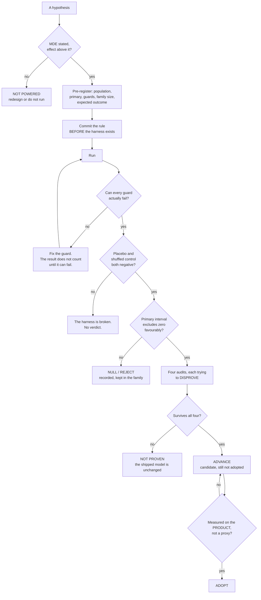
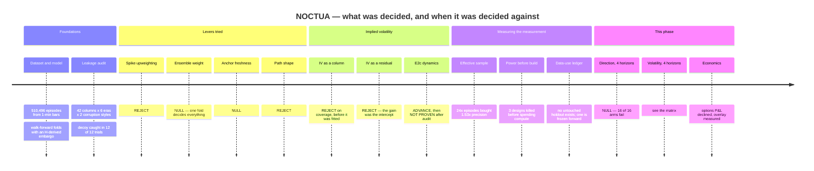

# NOCTUA — volatility and probabilistic direction
*Educational research. Not financial advice. Generated by `python -m model.research.report`; every table is read from an artifact rather than transcribed.*

## Executive summary

Phases 1 and 2 reported that the shipped model was unchanged by any of this. Phase 3 changed it: the served scalar is now a different **functional** of the same forward pass, and that single change reverses the phase's headline volatility result. The direction result and the economic boundary are unaffected, and both still stand.

- **NOCTUA's deficit against the HAR family was the scalar it reported, not the model.** QLIKE is minimised by the conditional *mean* of variance; the served scalar was the *median* of the same forward pass. Reading the mean instead — nothing refitted, no parameter added — improves raw QLIKE by **+13.29%** / **+20.65%** / **+26.00%** / **+11.90%** at H = 1 / 6 / 24 / 168. After a **symmetric** two-parameter recalibration given to every teacher, NOCTUA leads at H = 1 (+8.45% over `garch_t`), H = 6 (+5.41% over `har_short`), H = 24 (+5.37% over `har_short`), and H = 168 is a tie (+0.36%). This reverses the Phase 1 headline that it fails at all four horizons.
- **Direction is closed at all four horizons (1h, 6h, 24h, 168h).** 8 of 8 model arms fail their pre-registered rule. The paired per-episode interval excludes zero on the *adverse* side — the arm is worse than the calibration-window base rate — in 5 of 8 rows and straddles zero in 3, at n up to 49,114 per horizon. Both negative controls behave. This is a measured absence, not an underpowered one.
- **The volatility matrix**, one NOCTUA arm per horizon against the mandatory baseline family: **1h** vs `persistence` — `noctua` fails (-0.04601), `noctua40` fails (+0.00152); **6h** vs `har_short` — `noctua` fails (-0.02424), `noctua40` fails (-0.00868); **24h** vs `har_short` — `noctua` fails (-0.00037), `noctua40` fails (-0.04294); **168h** vs `har_short` — `noctua` not evaluable, `noctua40` fails (-0.02442). 0 row(s) clear the pre-registered interval. Baselines refitted **per horizon**, so they know the horizon NOCTUA knows. Under the earlier horizon-blind fits NOCTUA cleared at H = 24 and H = 168; neither survives, and at H = 168 the pooled baseline had been costing itself a factor of 2.06.
- **The production headline survives its own comparison and fails a better one.** Against the arm it is published against it is +6.16% and clears; against `har_short` — a baseline that was already in `noctua/baselines.py` and had never been scored — it is +5.45% and does not. Twice in this phase the strongest available baseline turned out to already exist here and to be missing from the arm list.
- **An options P&L cannot be produced honestly here and is not produced.** What replaces it is a volatility-targeting overlay whose primary endpoint is risk control rather than return.

Three things found by guards rather than by looking:

- A comment in the direction benchmark said only one feature column depended on
  the horizon. **Five do.** The benchmark was re-run from corrected features
  rather than defended — a null produced with degraded inputs is not a null.
- The default bootstrap block length is a rule of thumb about *sample size* and
  knows nothing about the *overlap* it exists to absorb. At the weekly horizon
  it was about a fifth of the shared window. Every interval here uses a block
  of at least twice the forward window, and the narrower one is reported beside
  it.
- The research ledger's schema was enforced on one write path only. Checking
  the file instead found a dangling supersede pointer and a one-sided link.
  Both are now gated in CI.

## Assumptions this rests on

1. **Realized volatility from 5-minute returns is the target**, not an
   unobservable. Every arm is scored against the same estimator, so a bias in
   it cancels in the comparison — but the *level* of any QLIKE figure inherits
   it.
2. **QLIKE is the loss.** It is asymmetric: at a factor-2 error, under-forecast
   is penalised 1.60× more than over-forecast, and it is minimised by the
   conditional **mean** of variance, not the median. This item used to end
   "the shipped model reports a median, which is a known and unresolved
   mismatch (`E-scale`, still open)". **That was resolved and this line did not
   follow.** `P3-functional-adopt` changed serving to publish `sigma_mean` of
   the same forward pass; the reported level rose 27.7% on the current anchor
   and `tests/test_level_report.py` gates the separation. What remains open is
   not the functional but the **width**: the predictive distribution is
   over-dispersed by 11–28% and correcting it is ADVANCE, not adopted
   (`P3-dispersion-barriers-result`).
3. **Walk-forward folds with an H-derived embargo** are the evaluation.
   Consecutive episodes overlap by construction, so all intervals are
   moving-block bootstraps and the block is at least twice the forward window.
4. **The trading costs in the economic section are assumptions, not
   measurements.** No order book, no fee schedule. Three levels are reported
   and a ranking that changes across them is declared cost-dependent.
5. **No untouched historical holdout exists.** Every calendar year has
   influenced training, calibration, feature selection, model selection or
   experiment design. This is documented year by year in
   `research/DATA_USE.md`, and the only honest remedy — a forward holdout
   frozen 2026-08-28 — is stated there with the uncomfortable part included:
   at roughly one independent regime per year, resolving a 6% effect on
   fold-level inference needs years, not weeks.
6. **The shipped model has not changed at any point in this work.** Nothing in
   this report is an adoption.

## Volatility: the four-horizon matrix

Every OLS baseline here is refitted **per horizon** and `log_har_cal` is in the arm list. That matters: the first version of this matrix fitted the baselines once on the pooled sample spanning all four horizons, so they carried no horizon term while NOCTUA sees `cal_H`. The `_pooled` arms below are those horizon-blind fits, kept so the size of the confound is a number rather than an argument — at H = 168 the pooled fit costs the baseline a factor of **2.06**.

Under the horizon-blind baselines NOCTUA cleared at H = 24 (+0.03032) and H = 168 (+0.14462). **Neither survives here.** That reversal is the result, and it was pre-registered as the outcome I should be prepared for.

Every arm at a given horizon is scored on the **same episodes**, with the same target and the same loss. The baseline to beat is chosen on the **calibration** slice and never on test; a `_pooled` arm is never eligible to be chosen.
Bonferroni within this family: 4 rows, so intervals are at 98.75%. Seeds: 3.

### H = 1h — 49,113 test episodes, folds [2021, 2022, 2023, 2024, 2025, 2026]
Best baseline by calibration QLIKE: **persistence** persistence 0.6256 · log_har_cal 0.8224 · log_har 0.8469 · har_short 1.3987

| arm | QLIKE | vs best | worst fold | spike | calm | paired CI (blocks) | same at n^(1/3)? |
|---|---:|---:|---:|---:|---:|---|---|
| `noctua` | 0.67167 | -0.04601 | 0.87423 | 6.1230 | 0.3846 | [-0.06687, -0.02663] (37) | yes |
| `noctua40` | 0.62413 | +0.00152 | 0.80340 | 5.4247 | 0.3713 | [-0.01723, +0.01915] (37) | yes |
| `garch_normal` | 0.60615 | +0.01951 | 0.83591 | 2.4210 | 0.5106 | [+0.00023, +0.04144] (37) | — |
| `garch_t` | 0.57409 | +0.05157 | 0.77681 | 2.9773 | 0.4475 | [+0.03453, +0.07122] (37) | — |
| `har_short` | 1.03153 | -0.40588 | 2.83989 | 12.4668 | 0.4293 | [-1.52927, +0.01884] (37) | — |
| `har_short_pooled` | 0.54026 | +0.08540 | 0.69433 | 4.0815 | 0.3538 | [+0.03485, +0.11284] (37) | — |
| `log_har` | 0.82396 | -0.19830 | 1.03672 | 7.3537 | 0.4801 | [-0.22622, -0.17366] (37) | — |
| `log_har_cal` | 0.80446 | -0.17881 | 1.01449 | 7.2245 | 0.4664 | [-0.20600, -0.15446] (37) | — |
| `log_har_cal_pooled` | 0.66228 | -0.03662 | 0.82185 | 5.6321 | 0.4006 | [-0.05930, -0.01691] (37) | — |
| `log_har_pooled` | 0.63443 | -0.00877 | 0.81088 | 4.8659 | 0.4116 | [-0.02650, +0.00739] (37) | — |
| `noctua40_mean` | 0.54119 | +0.08446 | 0.75844 | 3.0068 | 0.4113 | [+0.06902, +0.10163] (37) | — |
| `noctua_mean` | 0.51599 | +0.10967 | 0.72351 | 3.0362 | 0.3833 | [+0.09384, +0.12710] (37) | — |
| `persistence` | 0.62566 | +0.00000 | 0.85584 | 3.9384 | 0.4512 | — (is the baseline) | — |

Pre-registered verdict: **noctua** DOES NOT CLEAR · **noctua40** DOES NOT CLEAR

The `_mean` arms are reported here but receive **no pre-registered verdict**. The family was fixed a priori at four rows — one primary contrast per horizon — and that contrast is the median arm, the one that was actually served when the registration was written. The mean arms were added after the fact; admitting them to the family would be enlarging it until something clears. Their claim is made in [the functional section](#volatility-the-functional-the-loss-actually-wants) instead, under a correction applied symmetrically to every teacher.

### H = 6h — 49,114 test episodes, folds [2021, 2022, 2023, 2024, 2025, 2026]
Best baseline by calibration QLIKE: **har_short** har_short 0.4367 · log_har_cal 0.4601 · persistence 0.4604 · log_har 0.4843

| arm | QLIKE | vs best | worst fold | spike | calm | paired CI (blocks) | same at n^(1/3)? |
|---|---:|---:|---:|---:|---:|---|---|
| `noctua` | 0.44134 | -0.02424 | 0.59200 | 3.4404 | 0.2834 | [-0.04181, -0.00326] (37) | yes |
| `noctua40` | 0.42578 | -0.00868 | 0.54937 | 3.3636 | 0.2711 | [-0.02534, +0.01225] (37) | yes |
| `garch_normal` | 0.42323 | -0.00613 | 0.59696 | 1.4482 | 0.3693 | [-0.03476, +0.02827] (37) | — |
| `garch_t` | 0.41228 | +0.00482 | 0.55825 | 1.8055 | 0.3389 | [-0.02022, +0.03689] (37) | — |
| `har_short` | 0.41710 | +0.00000 | 0.55484 | 2.9830 | 0.2820 | — (is the baseline) | — |
| `har_short_pooled` | 0.38332 | +0.03378 | 0.50411 | 2.6954 | 0.2616 | [+0.02629, +0.04292] (37) | — |
| `log_har` | 0.46804 | -0.05094 | 0.60604 | 3.4057 | 0.3133 | [-0.06829, -0.03011] (37) | — |
| `log_har_cal` | 0.44703 | -0.02993 | 0.58279 | 3.3123 | 0.2961 | [-0.04733, -0.00859] (37) | — |
| `log_har_cal_pooled` | 0.45578 | -0.03868 | 0.56137 | 3.5767 | 0.2914 | [-0.05857, -0.01589] (37) | — |
| `log_har_pooled` | 0.43112 | -0.01402 | 0.55140 | 3.1179 | 0.2896 | [-0.02953, +0.00674] (37) | — |
| `noctua40_mean` | 0.33784 | +0.07926 | 0.49260 | 1.7751 | 0.2622 | [+0.05678, +0.10699] (37) | — |
| `noctua_mean` | 0.32535 | +0.09175 | 0.47190 | 1.7032 | 0.2528 | [+0.06922, +0.11908] (37) | — |
| `persistence` | 0.45301 | -0.03591 | 0.64660 | 2.3781 | 0.3516 | [-0.05453, -0.01300] (37) | — |

Pre-registered verdict: **noctua** DOES NOT CLEAR · **noctua40** DOES NOT CLEAR

The `_mean` arms are reported here but receive **no pre-registered verdict**. The family was fixed a priori at four rows — one primary contrast per horizon — and that contrast is the median arm, the one that was actually served when the registration was written. The mean arms were added after the fact; admitting them to the family would be enlarging it until something clears. Their claim is made in [the functional section](#volatility-the-functional-the-loss-actually-wants) instead, under a correction applied symmetrically to every teacher.

### H = 24h — 49,096 test episodes, folds [2021, 2022, 2023, 2024, 2025, 2026]
Best baseline by calibration QLIKE: **har_short** har_short 0.3015 · log_har_cal 0.3077 · log_har 0.3337 · persistence 0.4883

| arm | QLIKE | vs best | worst fold | spike | calm | paired CI (blocks) | same at n^(1/3)? |
|---|---:|---:|---:|---:|---:|---|---|
| `noctua` | 0.27860 | -0.00037 | 0.40441 | 1.9471 | 0.1907 | [-0.01579, +0.01112] (48) | yes |
| `noctua40` | 0.32117 | -0.04294 | 0.40599 | 2.3702 | 0.2133 | [-0.06047, -0.02792] (48) | yes |
| `garch_normal` | 0.32969 | -0.05145 | 0.45076 | 0.8918 | 0.3001 | [-0.07932, -0.01901] (48) | — |
| `garch_t` | 0.30260 | -0.02437 | 0.37981 | 1.1684 | 0.2570 | [-0.04504, +0.00008] (48) | — |
| `har_short` | 0.27823 | +0.00000 | 0.36459 | 1.8195 | 0.1971 | — (is the baseline) | — |
| `har_short_pooled` | 0.31563 | -0.03740 | 0.40276 | 2.0464 | 0.2245 | [-0.04643, -0.02978] (48) | — |
| `log_har` | 0.30635 | -0.02812 | 0.39088 | 2.1044 | 0.2117 | [-0.03758, -0.01994] (48) | — |
| `log_har_cal` | 0.28237 | -0.00414 | 0.36406 | 2.0071 | 0.1916 | [-0.01301, +0.00400] (48) | — |
| `log_har_cal_pooled` | 0.34977 | -0.07154 | 0.42441 | 2.5805 | 0.2323 | [-0.09252, -0.05362] (48) | — |
| `log_har_pooled` | 0.34423 | -0.06600 | 0.42514 | 2.4079 | 0.2356 | [-0.08400, -0.05114] (48) | — |
| `noctua40_mean` | 0.23768 | +0.04055 | 0.33495 | 1.1949 | 0.1873 | [+0.02335, +0.06080] (48) | — |
| `noctua_mean` | 0.23038 | +0.04785 | 0.31703 | 1.1118 | 0.1840 | [+0.02982, +0.06952] (48) | — |
| `persistence` | 0.45528 | -0.17705 | 0.70491 | 2.1064 | 0.3683 | [-0.23595, -0.13310] (48) | — |

Pre-registered verdict: **noctua** DOES NOT CLEAR · **noctua40** DOES NOT CLEAR

The `_mean` arms are reported here but receive **no pre-registered verdict**. The family was fixed a priori at four rows — one primary contrast per horizon — and that contrast is the median arm, the one that was actually served when the registration was written. The mean arms were added after the fact; admitting them to the family would be enlarging it until something clears. Their claim is made in [the functional section](#volatility-the-functional-the-loss-actually-wants) instead, under a correction applied symmetrically to every teacher.

### H = 168h — 48,952 test episodes, folds [2021, 2022, 2023, 2024, 2025, 2026]
Best baseline by calibration QLIKE: **har_short** har_short 0.1716 · log_har_cal 0.1741 · log_har 0.1741 · persistence 0.6504

| arm | QLIKE | vs best | worst fold | spike | calm | paired CI (blocks) | same at n^(1/3)? |
|---|---:|---:|---:|---:|---:|---|---|
| `noctua40` | 0.20636 | -0.02442 | 0.27946 | 1.0691 | 0.1609 | [-0.05395, -0.00491] (336) | yes |
| `garch_normal` | 0.52390 | -0.34196 | 0.75040 | 0.1935 | 0.5413 | [-0.42114, -0.26029] (336) | — |
| `garch_t` | 0.41759 | -0.23565 | 0.57133 | 0.2624 | 0.4258 | [-0.30016, -0.16655] (336) | — |
| `har_short` | 0.18194 | +0.00000 | 0.25486 | 0.9811 | 0.1399 | — (is the baseline) | — |
| `har_short_pooled` | 0.37544 | -0.19350 | 0.52079 | 1.6872 | 0.3064 | [-0.27670, -0.13194] (336) | — |
| `log_har` | 0.18424 | -0.00231 | 0.25575 | 1.0134 | 0.1406 | [-0.00478, +0.00026] (336) | — |
| `log_har_cal` | 0.18424 | -0.00231 | 0.25575 | 1.0134 | 0.1406 | [-0.00478, +0.00026] (336) | — |
| `log_har_cal_pooled` | 0.23416 | -0.05222 | 0.32384 | 1.0105 | 0.1933 | [-0.09066, -0.02637] (336) | — |
| `log_har_pooled` | 0.35018 | -0.16824 | 0.45074 | 1.7394 | 0.2770 | [-0.24238, -0.11033] (336) | — |
| `noctua40_mean` | 0.18181 | +0.00013 | 0.24866 | 0.6607 | 0.1566 | [-0.02147, +0.02133] (336) | — |
| `persistence` | 0.61862 | -0.43668 | 1.17761 | 1.6316 | 0.5653 | [-0.64142, -0.29751] (336) | — |

Pre-registered verdict: **noctua** NOT EVALUABLE · **noctua40** DOES NOT CLEAR

The `_mean` arms are reported here but receive **no pre-registered verdict**. The family was fixed a priori at four rows — one primary contrast per horizon — and that contrast is the median arm, the one that was actually served when the registration was written. The mean arms were added after the fact; admitting them to the family would be enlarging it until something clears. Their claim is made in [the functional section](#volatility-the-functional-the-loss-actually-wants) instead, under a correction applied symmetrically to every teacher.

The fold-level spread is carried in the artifact as `per_fold` and is **not** the primary. `vol-matrix-power` measured its minimum detectable effect at 5.21% / 11.76% / 31.68% / 65.48% of the persistence baseline at H = 1 / 6 / 24 / 168, against a 4.98% reference effect — one row marginal, three not powered. That was measured *before* the matrix was built, which is the only time the measurement is worth anything.

## Volatility: the functional the loss actually wants

QLIKE is `mean(r − log r − 1)` with `r = RV²/σ²`, and it is minimised at `σ² = E[RV²]` — the conditional **mean** of variance. NOCTUA's network emits a 32-atom quantile representation, and the scalar it reported was the **median**. Every earlier comparison in this document therefore scored NOCTUA's median against its rivals' means, under a loss that wants the mean.

Reading `sigma_mean` instead is the same forward pass. Nothing is refitted, no parameter is added, no data is touched:

| H | median (raw) | mean (raw) | improvement | median (MZq) | mean (MZq) | improvement |
|---:|---:|---:|---:|---:|---:|---:|
| 1 | 0.62413 | 0.54119 | **+13.29%** | 0.55821 | 0.53295 | +4.52% |
| 6 | 0.42578 | 0.33784 | **+20.65%** | 0.35260 | 0.33890 | +3.88% |
| 24 | 0.32117 | 0.23768 | **+26.00%** | 0.25520 | 0.25159 | +1.41% |
| 168 | 0.20636 | 0.18181 | **+11.90%** | 0.22441 | 0.22195 | +1.09% |

The raw column is the size of the reporting defect. The MZq column is what survives once **every** teacher, NOCTUA included, is given the same two free parameters — a level and a slope, fitted on each fold's calibration slice and applied to its test slice. Applying such a correction to one model and not the others is how a favoured model is handed a free fit, so it is applied symmetrically or not at all.

Against the best **non-NOCTUA** arm at each horizon, under that symmetric correction:

| H | best rival | rival QLIKE | NOCTUA (mean) | margin |
|---:|---|---:|---:|---:|
| 1 | `garch_t` | 0.58213 | 0.53295 | +8.45%  |
| 6 | `har_short` | 0.35831 | 0.33890 | +5.41%  |
| 24 | `har_short` | 0.26588 | 0.25159 | +5.37%  |
| 168 | `har_short` | 0.22276 | 0.22195 | +0.36% — a tie |

**H = 168 is a tie, not a win.** A margin under one percent is not a result, and it is written as a tie here because the temptation to round it up is exactly what this document exists to prevent.

This falsifies the Phase 1 headline that NOCTUA fails against the HAR family at every horizon. What failed at every horizon was the *scalar being reported*, not the model producing it — and the fix costs nothing, because the quantity was already in the forward pass.

### The slope defect, and what it turned out to be

A Mincer–Zarnowitz slope β below 1 means the forecast over-reacts to its own signal; above 1, that it under-reacts. Neither is information about volatility, and both are removable by an affine map any competitor can also apply. The open question was whether NOCTUA's β is an information defect — which would call for a retrain — or an affine one.

It is neither, uniformly. Fitting the correction on each fold's calibration slice, applying it to that fold's test slice, and **re-measuring** the slope on rows the correction never saw (re-fitting on test would report 1.000 by construction, and would confirm itself whatever the data said):

**Every β in this section is measured on the RAW network, and the served product BLENDS it with Log-HAR at `blend_w = 0.25`.** The blend is affine in log space, so β as a function of the weight is computable without retraining, and it is monotone *decreasing* in the neural share: pooled, at H = 1 / 6 / 24 the raw network sits at 1.214 / 1.148 / 1.032 and the shipped weight at **1.077 / 1.058 / 1.010**; at H = 168 the raw network over-reacts at 0.835 and the blend raises it to 0.959. The blend moves β toward 1 at every horizon, so the served pipeline's slope is better than every number in the table below. The defect is in the neural stage — which is what the table is about — and the blend is already treating roughly a third of it (`P3-blend-beta-result`).

| H | independent calibration windows per fold | β raw | β after MZq | reading |
|---:|---:|---:|---:|---|
| 1 | 4,247 | 1.303 | 1.006 | AFFINE (correction transfers) |
| 6 | 707 | 1.236 | 1.019 | AFFINE (correction transfers) |
| 24 | 176 | 1.116 | 1.047 | PARTIAL |
| 168 | 24 | 0.915 | 0.916 | UNESTIMABLE (correction does not transfer) |

Whether the correction transfers tracks the number of independent windows it was fitted on, monotonically, and nothing else in the table does. Episodes are anchored hourly against an H-hour forward window, so consecutive rows share H−1 of their H hours and the independent count is of order n/H. At H = 168 a two-parameter regression is fitted on **twenty-four** effective observations per fold, and the slopes it returns say so — one of the six is negative, which asserts that the more NOCTUA forecasts, the less volatility realises.

That was first read as regime variation, on the grounds that the offending fold is 2022 — Terra, 3AC, FTX. Its own neighbour refutes it: 2022's calibration slope at H = 168 is −0.017 and its **test** slope at the same horizon is 0.918, entirely ordinary. An estimate that disagrees that violently with the slice next door is noise, not a regime, and the attribution was withdrawn.

The consequence is a redirection. The plan named a CRPS-trained variant as the remedy for β. At H = 1 and H = 6 two out-of-sample parameters already take β to 1.006 and 1.019, so a new loss would be fixing a solved problem; at H = 168 the binding constraint is a calibration window of 24 independent observations, which no loss function changes.

One caution about every pooled β above: it is a mixture across six folds carrying six different levels, and it **understates** the per-fold defect at both ends — 1.303 pooled against 1.370 median fold at H = 1; 0.915 pooled against 0.783 median fold at H = 168.

### What changed in what is served

`REPORT_FUNCTIONAL = "mean"`: the served scalar is now the mean of the same forward pass. This is safe by construction rather than by measurement — the reported scalar moves the barrier curves by 0.000e+00, because the committee specialists build their curves from `sigma_atoms` and never read it, while `sigma_atoms` moves them by 8.864e−03. The live anchor moves from 2.067% to 2.640%.

**Scope correction.** Everything above this subsection is the RAW network; the serving path BLENDS with Log-HAR at `blend_w = 0.25`. A uniform log-shift cannot change the mean/median ratio, but it changes the level that ratio multiplies — so the raw network's 1.43 becomes ~1.0 under the mean, while the blended path's 1.12 overshoots to 0.82. On the production slice the median's calibration ratio is **1.1231** and the mean's is **0.8181**, so the median is the closer of the two to 1 there and the “calibrated to within 1–4% with nothing fitted” claim does **not** hold on the pipeline that is served.

The mean is nevertheless still reported, because the paired contrast on that slice is **not separated**: median 0.25619 against mean 0.26039, −1.64% favouring the median, CI [−0.03105, +0.01798], 2 of 6 folds favouring the mean. The production configuration is one episode per day, so n is 2,046 there against 49,000 in the zoo and a 1.6% difference cannot resolve. Flipping a level decision on a point estimate is how `phase2/level-scale` oscillated three times, so it stays put until a properly powered contrast on that slice says otherwise (`P3-functional-adopt-scope`).

## Volatility: the production slice, against the best baseline

The production configuration is H = 19 anchored at 17:00 UTC. This table asks whether the published advantage survives the **strongest baseline this repository already contains**, with the bar chosen on the calibration slice and never on test.

2,046 test episodes over 6 folds. Bonferroni at family size 5 → 99% intervals, blocks of 38. Best baseline by calibration QLIKE: **har_short** · har_short 0.3160 · log_har_cal 0.3185 · log_har 0.3433 · persistence 0.4571

| arm | QLIKE | vs best | rel % | worst fold | paired CI |
|---|---:|---:|---:|---:|---|
| `noctua` | 0.25619 | +0.01478 | +5.45 | 0.36088 | [-0.00316, +0.03030] |
| `har_short` | 0.27096 | +0.00000 | +0.00 | 0.37127 | — (is the baseline) |
| `log_har` | 0.28866 | -0.01770 | -6.53 | 0.38565 | [-0.02873, -0.00674] |
| `log_har_cal` | 0.26890 | +0.00207 | +0.76 | 0.36693 | [-0.01287, +0.01617] |
| `log_har_cal_pooled` | 0.27300 | -0.00204 | -0.75 | 0.37458 | [-0.01723, +0.01168] |
| `log_har_pooled` | 0.29846 | -0.02750 | -10.15 | 0.39788 | [-0.04100, -0.01483] |
| `noctua_mean` | 0.26039 | +0.01057 | +3.90 | 0.39360 | [-0.01745, +0.03236] |
| `persistence` | 0.39620 | -0.12523 | -46.22 | 0.61058 | [-0.18649, -0.08427] |

**The incumbent claim is confirmed.** Against `log_har_cal_pooled` — the arm the published headline is actually measured against — NOCTUA is +0.01682 (+6.16%), CI [+0.01000, +0.02262], which clears.

**The primary fails anyway, for a different reason.** Against `har_short` — which extends Corsi's cascade downward with `har_1h` and `har_6h`, has been in `noctua/baselines.py` throughout, and had never been scored as a competitor — NOCTUA is +5.45% and **DOES NOT CLEAR**. The unadjusted 95% interval [+0.00131, +0.02627] straddles zero too, so this is not a multiple-testing artifact.

NOCTUA still posts the best pooled QLIKE of any arm here. It is simply not *significantly* better than the best baseline at this sample size.

**The arm that is now served, scored on this slice for the first time.** Every number above is `sigma_med` — the scalar this slice was serving when the family was registered. `noctua_mean` is the functional QLIKE is minimised by, off the same forward pass and after the same blend: 0.26039 against `har_short`, +3.90% versus +5.45% for the median. It carries **no pre-registered verdict** — the family was fixed at 5 rows before this question existed, and adding arms to a family until one clears is not a test. It is reported because this is the slice that is actually served, and until now the headline for it had never been measured on the scalar it actually serves.

## Direction as a probability forecast

The baseline is the **calibration-window base rate**, not 0.5. P(R>0) rises with horizon and moves between years, so beating a coin demonstrates nothing. Calibration slope and intercept are **pass conditions**; AUC is reported and is explicitly not one.

| H | arm | Brier | BSS vs calib | AUC | cal slope | cal int | paired CI | verdict |
|---|---|---:|---:|---:|---:|---:|---|---|
| 1 | `base_unc` | 0.25001 | +0.00028 | 0.4976 | +0.001 | +0.018 | [-0.000176, +0.000039] | — |
| 1 | `base_calib` | 0.25008 | +0.00000 | 0.5009 | +0.001 | +0.018 | — | — |
| 1 | `logistic` | 0.25071 | -0.00253 | 0.5105 | +0.052 | +0.016 | [+0.000159, +0.001155] | FAIL |
| 1 | `gbm` | 0.25024 | -0.00065 | 0.5171 | +0.052 | +0.016 | [-0.000279, +0.000640] | FAIL |
| 1 | `placebo` | 0.25538 | -0.02119 | 0.4997 | +0.000 | +0.018 | [+0.003560, +0.007369] | — |
| 1 | `shuffled` | 0.25137 | -0.00516 | 0.4977 | +0.011 | +0.018 | [+0.000721, +0.002000] | — |
| 6 | `base_unc` | 0.25007 | +0.00140 | 0.4900 | +0.001 | +0.030 | [-0.000880, +0.000166] | — |
| 6 | `base_calib` | 0.25042 | +0.00000 | 0.5036 | +0.002 | +0.030 | — | — |
| 6 | `logistic` | 0.25225 | -0.00730 | 0.5043 | +0.020 | +0.028 | [+0.000704, +0.003112] | FAIL |
| 6 | `gbm` | 0.25116 | -0.00296 | 0.5153 | +0.051 | +0.026 | [-0.000350, +0.001875] | FAIL |
| 6 | `placebo` | 0.25183 | -0.00565 | 0.4967 | +0.007 | +0.030 | [+0.000565, +0.002417] | — |
| 6 | `shuffled` | 0.25316 | -0.01093 | 0.5044 | -0.014 | +0.031 | [+0.001078, +0.004891] | — |
| 24 | `base_unc` | 0.25018 | +0.00797 | 0.4819 | -4.242 | +0.450 | [-0.004344, +0.000152] | — |
| 24 | `base_calib` | 0.25219 | +0.00000 | 0.4934 | -0.011 | +0.050 | — | — |
| 24 | `logistic` | 0.25980 | -0.03015 | 0.4974 | -0.006 | +0.050 | [+0.003559, +0.012284] | FAIL |
| 24 | `gbm` | 0.25566 | -0.01375 | 0.5080 | -0.020 | +0.052 | [+0.000739, +0.006664] | FAIL |
| 24 | `placebo` | 0.25755 | -0.02126 | 0.4938 | -0.025 | +0.056 | [+0.002054, +0.009136] | — |
| 24 | `shuffled` | 0.25330 | -0.00439 | 0.4956 | -0.005 | +0.050 | [-0.000027, +0.002427] | — |
| 168 | `base_unc` | 0.25046 | +0.02810 | 0.4614 | -5.347 | +0.807 | [-0.013828, -0.001187] | — |
| 168 | `base_calib` | 0.25770 | +0.00000 | 0.5042 | +0.052 | +0.064 | — | — |
| 168 | `logistic` | 0.26358 | -0.02281 | 0.5178 | +0.042 | +0.066 | [-0.000891, +0.012726] | FAIL |
| 168 | `gbm` | 0.28009 | -0.08691 | 0.5021 | -0.039 | +0.089 | [+0.012030, +0.033454] | FAIL |
| 168 | `placebo` | 0.26818 | -0.04068 | 0.5127 | +0.010 | +0.073 | [+0.003138, +0.018897] | — |
| 168 | `shuffled` | 0.25991 | -0.00860 | 0.5142 | -0.005 | +0.081 | [-0.000113, +0.004766] | — |

A **positive** paired CI means the arm is **worse** than the baseline: the quantity bootstrapped is arm-minus-baseline Brier.

## Economic validation, and its boundary

**There is no options P&L in this report and there will not be one.** `model/artifacts/datasources.json` records 18 probes and 2 reachable endpoints; every exchange API and aggregator returns 403 through the egress proxy. The only option-adjacent series on disk is the Deribit DVOL volatility *index* — a level, with no strikes, no expiries, no bid/ask, no size, no prints. An options P&L could only be simulated, and every assumption the simulation needed would do more work than the forecast being tested.

A directional backtest is also absent, for a different reason: the signal was measured to carry no information at n ≈ 49,000 per horizon, so its equity curve would be a random walk with a fee drag.

What *can* be measured is a **volatility-targeting overlay on spot BTC**, which is the actual use of a volatility forecast for anyone without an options book. Its primary endpoint is risk control — |realised annualised vol − target| — not return.

Target 60% annualised, weight capped at 3.0, H = 24h, rebalanced at 00:00 UTC so consecutive windows do not overlap. Costs [5.0, 10.0, 25.0] bps round-trip — **assumptions, not measurements**: this repository has no order book and no fee schedule.

| arm | mean \|vol err\| | worst | realised vol | turnover | mean w | net @5bp | net @10bp | net @25bp | paired CI vs best |
|---|---:|---:|---:|---:|---:|---:|---:|---:|---|
| `noctua` | 0.0783 | 0.1346 | 0.6783 | 0.2074 | 1.440 | +0.079 | +0.044 | -0.059 | [-0.1145, -0.0325] |
| `noctua40` | 0.0774 | 0.1294 | 0.6774 | 0.2052 | 1.438 | +0.073 | +0.038 | -0.064 | [-0.1117, -0.0327] |
| `constant_w` | 0.0977 | 0.2684 | 0.6282 | 0.0036 | 1.153 | +0.140 | +0.139 | +0.137 | [-0.1530, -0.0199] |
| `garch_normal` | 0.0868 | 0.1497 | 0.5137 | 0.1791 | 1.027 | +0.033 | +0.002 | -0.091 | [-0.1153, -0.0358] |
| `garch_t` | 0.0426 | 0.0749 | 0.5795 | 0.2945 | 1.175 | +0.001 | -0.050 | -0.201 | [-0.0395, -0.0193] |
| `har_short` | 0.0646 | 0.0862 | 0.6646 | 0.2395 | 1.398 | +0.074 | +0.033 | -0.087 | [-0.0818, -0.0332] |
| `log_har` | 0.0763 | 0.1108 | 0.6763 | 0.2169 | 1.399 | +0.076 | +0.040 | -0.069 | [-0.1009, -0.0393] |
| `noctua40_mean` | 0.0096 | 0.0221 | 0.5921 | 0.1864 | 1.267 | +0.059 | +0.028 | -0.065 | — (is the best arm) |
| `noctua_mean` | 0.0126 | 0.0254 | 0.5897 | 0.1819 | 1.259 | +0.064 | +0.033 | -0.057 | [-0.0040, -0.0018] |
| `persistence` | 0.1106 | 0.1745 | 0.7106 | 0.4098 | 1.467 | -0.024 | -0.093 | -0.301 | [-0.1593, -0.0611] |

| arm | t-CI on the paired difference | t p | perm p | floor | MDE(80%) | powered? |
|---|---|---:|---:|---:|---:|---|
| `noctua` | [-0.1166, -0.0208] | 0.0142 | 0.0156  *(at floor)* | 0.0156 | 0.0650 | yes |
| `noctua40` | [-0.1141, -0.0215] | 0.0131 | 0.0156  *(at floor)* | 0.0156 | 0.0628 | yes |
| `constant_w` | [-0.1933, +0.0173] | 0.0843 | 0.0469 | 0.0156 | 0.1430 | **NOT POWERED** |
| `garch_normal` | [-0.1348, -0.0194] | 0.0185 | 0.0312 | 0.0156 | 0.0783 | **NOT POWERED** |
| `garch_t` | [-0.0571, -0.0087] | 0.0173 | 0.0156  *(at floor)* | 0.0156 | 0.0328 | yes |
| `har_short` | [-0.0867, -0.0233] | 0.0067 | 0.0156  *(at floor)* | 0.0156 | 0.0431 | yes |
| `log_har` | [-0.1045, -0.0289] | 0.0062 | 0.0156  *(at floor)* | 0.0156 | 0.0514 | yes |
| `noctua40_mean` | — (is the best arm) | | | | | |
| `noctua_mean` | [-0.0049, -0.0010] | 0.0122 | 0.0312 | 0.0156 | 0.0027 | yes |
| `persistence` | [-0.1631, -0.0388] | 0.0087 | 0.0156  *(at floor)* | 0.0156 | 0.0844 | yes |

`n` here is the number of **folds**, and that is intrinsic rather than a design choice: realised volatility is a property of a series, so exactly one number exists per fold. Per STATS_PROTOCOL §2–3 a bootstrap over same-signed observations at this n cannot fail, so the t-interval governs where the two disagree — and they do disagree for `noctua`, where the block interval excludes zero adversely and the t-interval does not. The exact sign-flip permutation has a hard one-sided floor of 2⁻⁶ = 0.0156, so **no Bonferroni-corrected claim is available from this design at any effect size**.

Best arm on the primary: **noctua40_mean**. Ranking by net return identical at all three cost levels: **False** — so the return comparison is **cost-dependent** and no arm is declared better on it.

## How a hypothesis becomes a result here



## Timeline



## The experiment register

188 pre-registered experiments. **ADOPT** 22 · **ADVANCE** 38 · **DIAGNOSTIC** 3 · **NULL** 23 · **OPEN** 6 · **OPEN (answered by a later entry)** 50 · **REJECT** 44 · **WITHDRAWN** 2

The register is append-only, so a pre-registration keeps its OPEN verdict and its result arrives as a separate entry that supersedes it. **6** questions are genuinely unresolved; the rest of the OPEN rows have been answered.

Every row was registered with its decision rule **before** it ran. Failures are not deleted; they stay in the family and count against the multiple-testing correction.

| id | topic | verdict | question |
|---|---|---|---|
| `6b` | stageb | ADOPT | Should Stage B be trained against a causal sigma reference? |
| `freshness` | features | ADOPT | Does features.py discard the last complete hour before the anchor? |
| `direction` | direction | REJECT | Is the sign of the 19h return attainable from these features? |
| `lam_r` | head | NULL | Does reweighting the terminal-return head help? |
| `q_mx` | head | NULL | Does a dedicated max-excursion head improve barrier scores? |
| `reg_post_etf_drop` | regime | NULL | Does dropping the untrained regime flag hurt? |
| `efficiency` | shape | NULL | Do path-efficiency shape features help? |
| `5b` ⤳ | shape | WITHDRAWN | How far does BTC travel per unit of realized volatility? |
| `5b-bis` | shape | ADOPT | Same, with the benchmark sampled as the data actually is |
| `6l` ⤳ | refresh | REJECT | Does refreshing the training window beat a fit frozen in 2023? |
| `6m` | refresh | ADOPT | Same, with calibration-slice sizes matched |
| `6n` | refresh | REJECT | Does the DEPLOYABLE arm (fresh AND large calibration) pass? |
| `6o` | refresh | ADOPT | Does the refresh pass a properly powered test? |
| `shape` | shape | REJECT | Is the conditional variation in path shape predictable? |
| `92pct` ⤳ | oracle | WITHDRAWN | What share of barrier error would a perfect volatility forecast remove? |
| `9` | oracle | ADOPT | Same, through NOCTUA's own Stage B mapping |
| `atoms` | oracle | REJECT | Should the 32 sigma atoms be collapsed to a point at the median? |
| `lag` | lag | ADOPT | Is the one-day volatility lag fixable, or an information ceiling? |
| `defects` | defects | REJECT | Are the three open defects (untrained reg_post_etf, unused capacity, global-vs-hourly adaptive correction) rea |
| `11a` | capacity | REJECT | Is the low hidden-layer effective rank a training defect? |
| `levers` | lag | REJECT | Do spike-upweighting or anchor-freshness survive a proper walk-forward? |
| `levers2` | lag | OPEN | Does spike upweighting pass a SPIKE-CONDITIONAL rule? |
| `14` ⤳ | data | ADOPT | Do the harvested funding/DVOL series have usable history depth? |
| `phase0` | baseline | REJECT | Does the committed benchmark reproduce at SHA ab170b4? |
| `15` | data | ADOPT | Does the paged DVOL index endpoint deliver training-window history? |
| `phase0v2` | baseline | ADOPT | Is the benchmark pipeline deterministic run-to-run? |
| `16` | baseline | REJECT | Does the headline benchmark train the same configuration that ships? |
| `16b` | baseline | ADOPT | What is the baseline once the benchmark trains the shipped configuration? |
| `phase1` | lineage | OPEN | Can every one of the 42 feature columns be documented point-in-time? |
| `19` | lag | ADOPT | Are the freshest volatility features absent from the dominant Log-HAR anchor? |
| `E-anchor` ⤳ | lag | OPEN | Does adding har_1h/har_6h to BASE_COLS reduce the volatility lag? |
| `E-anchor-pre` | lag | NULL | Diagnostics from the E-anchor runs before a verdict exists |
| `toolchain` | infrastructure | ADOPT | Which protocol experiments are actually runnable in this environment? |
| `E-garch` | baselines | ADOPT | Does NOCTUA beat a properly fitted GARCH(1,1)? |
| `iv-coverage` ⤳ | iv | OPEN | Can Deribit DVOL implied volatility be used as a NOCTUA feature, given its coverage? |
| `iv-coverage-2` ⤳ | iv | OPEN | Can Deribit DVOL implied volatility be used as a NOCTUA feature, given its coverage? |
| `E-anchor-verdict` | lag | REJECT | Does adding har_1h and har_6h to BASE_COLS -- the Log-HAR anchor holding 75% of the blend -- reduce the volati |
| `ci-nan-defect` | machinery | ADOPT | Did E-anchor's pre-registered condition actually consult the data? |
| `E-power` ⤳ | methodology | OPEN | How much statistical power do this project's verdicts actually have, given every fold is scored on ~365 produc |
| `E-blend` | blend | NULL | Is a state-dependent ensemble weight (spike vs calm) better than the shipped constant 0.25? |
| `E-blend-1state` | blend | REJECT | Is a single walk-forward constant blend weight better than the shipped 0.25? |
| `E-power-prediction` ⤳ | methodology | OPEN | Before E-power's numbers exist: how much SHOULD the CI tighten on a 24x wider scoring slice, and what would ea |
| `iv-correction-audit` | machinery | ADOPT | Does eval/iv_correction.py measure what its pre-registered rule says it measures, BEFORE it is run? |
| `E2-iv-correction` | features | REJECT | Does Deribit DVOL implied volatility carry information NOCTUA's own-past-bars cascade does not? |
| `E2b` ⤳ | features | OPEN | With the intercept removed, do the IV features carry any INCREMENTAL information? |
| `E-scale` ⤳ | calibration | OPEN | Should NOCTUA's point forecast be scaled up from the median toward the QLIKE-optimal mean? |
| `E2b-result` | features | REJECT | With the intercept removed, do the IV features carry any INCREMENTAL information? |
| `E2c` ⤳ | features | OPEN | Do DVOL's DYNAMICS carry incremental information once its redundant LEVEL is dropped? |
| `E2c-result` | features | ADVANCE | Do DVOL's DYNAMICS carry incremental information once its redundant LEVEL is dropped? |
| `E2-confirm` ⤳ | features | OPEN | Does E2c's correction survive the full pipeline, including the barrier curves? |
| `iv-coverage-closed` | features | ADVANCE | Can Deribit DVOL implied volatility be used as a NOCTUA feature, given its coverage? |
| `funding-coverage` ⤳ | features | OPEN | Is the funding rate usable as a forward-looking input, and at what coverage? |
| `E-power-amendment` ⤳ | methodology | OPEN | Is E-power's pre-registered primary quantity actually scale-free? |
| `E2c-not-an-intercept` | features | ADVANCE | Is E2c's correction genuinely episode-varying, or a per-fold level shift in disguise? |
| `E2c-sigma-sensitivity` | features | ADVANCE | Does E2c's conclusion depend on SIGMA_B, the shrinkage scale fixed a priori at 0.10? |
| `E-power-bands` ⤳ | methodology | OPEN | What will each possible value of the effective sample-size multiplier mean for the research programme? |
| `E-power-result` | methodology | REJECT | How much statistical power do this project's verdicts actually have? |
| `E2-confirm-slice` ⤳ | features | OPEN | Which scoring slice should E2-confirm run on, now that E-power has measured what each buys? |
| `E2-confirm-result` ⤳ | features | ADVANCE | Does E2c's IV correction survive the full pipeline, including the barrier curves? |
| `funding-features` | features | ADOPT | Are the funding-rate features buildable, causal, and adequately covered? |
| `E2-confirm-wide` ⤳ | features | ADVANCE | Does E2c's IV correction survive the full pipeline on the wide slice, where the deep-tail MCB guard has power? |
| `holdout-freeze` | methodology | REJECT | Does any historical period remain genuinely untouched and usable as a final holdout? |
| `horizon-label-spec` ⤳ | methodology | OPEN | Are the four horizons and the two distinct label families buildable, and what are the correct baselines? |
| `horizons-built` | methodology | ADOPT | Are the four protocol horizons (1h/6h/1d/1w) buildable, and what do their targets look like? |
| `direction-power` | direction | OPEN | Before building any direction model: which horizons can a 6-fold experiment actually resolve? |
| `D1-direction-bench` ⤳ | direction | NULL | Does any direction model beat the rolling base rate as a PROBABILITY forecast, at any horizon? |
| `E2-audit-downgrade` | features | REJECT | Does the IV result survive independent adversarial statistical and data audit? |
| `E2-paired-estimator` | features | ADVANCE | Does the IV effect survive an estimator that is actually capable of failing? |
| `E2-lag2-robust` | features | ADVANCE | Does the IV effect depend on Deribit's candle-timestamp convention -- the audit's highest-threat finding? |
| `audit-fixes` | machinery | ADOPT | Are the audit's mechanical findings fixed, and can the defects recur? |
| `E2-placebo-recheck` | features | ADVANCE | Does the 'beats the placebo' guard survive the corrected 365-day rotation? |
| `stats-protocol-locked` | methodology | ADOPT | What is the locked statistical protocol, after the audit? |
| `incumbent-under-protocol` | methodology | ADVANCE | Does NOCTUA's own headline claim -- that it beats Log-HAR -- survive the protocol just locked? |
| `vol-matrix-power` | methodology | OPEN | Before building the four-horizon volatility matrix: which rows can a 6-fold experiment resolve? |
| `vol-matrix` ⤳ | volatility | ADVANCE | Across four horizons (1h, 6h, 1d, 1w), does NOCTUA beat the mandatory baseline family on QLIKE, and does the a |
| `econ-scope` | economics | REJECT | What economic validation can this repository perform honestly, and what can it not? |
| `econ-voltarget` ⤳ | economics | OPEN | Does a better volatility forecast produce a better-controlled portfolio once rebalancing costs are charged? |
| `vol-matrix-fair` ⤳ | volatility | OPEN | Do the two rows that cleared vol-matrix survive a baseline family that is allowed to know the horizon? |
| `D1-direction-bench-corrected` | direction | NULL | Does any direction model beat the rolling base rate as a PROBABILITY forecast, once the features are built at  |
| `vol-matrix-fair-result` | volatility | REJECT | Do the two rows that cleared vol-matrix survive a baseline family that is allowed to know the horizon? |
| `E-prod-fairbaseline` ⤳ | volatility | OPEN | Does NOCTUA's headline production advantage over Log-HAR survive a horizon-aware baseline? |
| `E-prod-fairbaseline-result` | volatility | REJECT | Does NOCTUA's headline production advantage over Log-HAR survive a horizon-aware baseline? |
| `econ-voltarget-result` | economics | NULL | Does a better volatility forecast produce a better-controlled portfolio once rebalancing costs are charged? |
| `P2-armA-residual` ⤳ | phase2 | OPEN | Can NOCTUA learn only the residual of a cross-fitted teacher, and does that beat the teacher itself? |
| `P2-floor-defect` | data | ADVANCE | A missing hour is encoded as 'volatility was 1e-6'. What does that cost, and what should Phase 2 do about it? |
| `P2-scale-v2` ⤳ | phase2 | OPEN | Is a calib-fitted scalar on NOCTUA's sigma adoptable as NOCTUA V2's first component? |
| `P2-scale-v2-result` | phase2 | REJECT | Is a calib-fitted scalar on NOCTUA's sigma adoptable as NOCTUA V2's first component? |
| `P2-armA-result` ⤳ | phase2 | ADVANCE | Can NOCTUA learn only the residual of a cross-fitted teacher, and does that beat the teacher itself? |
| `P2-dataset-audit` | data | ADVANCE | What is the model actually fed, is it event-labelled, and what does that cost? |
| `P2-event-footprint` | data | ADVANCE | Do scheduled clock-anchored events drive the concentrated forecast error, and can that be tested without acqui |
| `P2-intraday-basis` ⤳ | features | OPEN | Does a richer hour-of-day basis capture the intraday error structure the single Fourier harmonic cannot repres |
| `P2-armA-adopt` ⤳ | phase2 | OPEN | Does Arm A's H=6 QLIKE gain survive the barrier battery when the residual architecture runs through the SHIPPE |
| `P2-armA-adopt-a1` ⤳ | phase2 | OPEN | Does Arm A's H=6 QLIKE gain survive the barrier battery when the residual architecture runs through the SHIPPE |
| `P2-pool-composition` ⤳ | phase2 | OPEN | Does har_short's accuracy at a given horizon depend on WHICH horizons it was pooled over during fitting? |
| `P2-pool-composition-a1` ⤳ | phase2 | OPEN | Does har_short's accuracy at a given horizon depend on WHICH horizons it was pooled over during fitting? |
| `P2-scorecard-rescaled` ⤳ | phase2 | OPEN | Does the teacher ranking survive giving every teacher its own calib-fitted level scalar? |
| `P2-pool-composition-result` | phase2 | NULL | Does har_short's accuracy at a given horizon depend on WHICH horizons it was pooled over during fitting? |
| `P2-scorecard-rescaled-result` ⤳ | phase2 | ADVANCE | Does the teacher ranking survive giving every teacher its own calib-fitted level scalar? |
| `P2-mean-level` ⤳ | phase2 | OPEN | Is NOCTUA's level bias exactly the median-vs-mean gap, and does the model's OWN per-episode conversion survive |
| `P2-armA-correction` | phase2 | REJECT | Does Arm A's H=6 cell survive comparators that are equipped under R39? |
| `P2-mean-level-a1` ⤳ | phase2 | OPEN | Is NOCTUA's level bias exactly the median-vs-mean gap, and does the model's OWN per-episode conversion survive |
| `P2-adaptive-wrong-functional` | phase2 | REJECT | Can the adaptive correction that SHIPS remove the level bias that P2-scorecard-rescaled measured? |
| `P2-level-report` ⤳ | phase2 | OPEN | Does reporting the conditional-MEAN volatility, while leaving the predictive object untouched, fix the QLIKE l |
| `P2-mean-level-result` | phase2 | REJECT | Is NOCTUA's level bias exactly the median-vs-mean gap, and does the model's OWN per-episode conversion survive |
| `P2-level-report-result` ⤳ | phase2 | ADVANCE | Does reporting the conditional-MEAN volatility, while leaving the predictive object untouched, fix the QLIKE l |
| `P2-trailing-scalar` ⤳ | phase2 | ADVANCE | Can a TRAILING estimate of the QLIKE scalar do the job of the fold-fitted one at serving, and what does the sh |
| `P2-level-report-adopt` | phase2 | ADOPT | Does the reporting fix pass its serving gate, and what exactly changed? |
| `P2-intraday-basis-result` | phase2 | NULL | Can a richer hour-of-day basis capture the intraday error structure the single Fourier harmonic cannot represe |
| `P2-dst-alignment` ⤳ | phase2 | OPEN | Is the intraday error footprint sharper in US EASTERN local time than in UTC, as scheduled macro releases woul |
| `P2-dst-alignment-result` | phase2 | NULL | Is the intraday error footprint sharper in US EASTERN local time than in UTC? |
| `P2-dst-shift` ⤳ | phase2 | OPEN | Does the H=1 error peak sit exactly ONE HOUR EARLIER in UTC during US summer than during US winter? |
| `P2-dst-shift-result` ⤳ | phase2 | ADVANCE | Does the H=1 error peak sit exactly ONE HOUR EARLIER in UTC during US summer than during US winter? |
| `P2-event-window` ⤳ | phase2 | OPEN | Does a small event-hour indicator defined in US EASTERN local time recover the intraday signal that 23 UTC dum |
| `P2-event-window-result` | phase2 | NULL | Does a small event-hour indicator defined in US EASTERN local time recover the intraday signal that 23 UTC dum |
| `P3-attention-feature` ⤳ | phase3 | OPEN | Does an hourly ATTENTION-INTENSITY feature -- how much is being written about BTC right now -- reduce the conc |
| `P2-seed-variance` ⤳ | phase2 | OPEN | How large is the training variance that the paired bootstrap omits, and does it account for BOTH the H=1 effec |
| `P2-seed-variance-result` | phase2 | REJECT | How large is the training variance the paired bootstrap omits, and does it account for BOTH the H=1 effect and |
| `P3-attention-feature-a1` ⤳ | phase3 | OPEN | Does an hourly ATTENTION-INTENSITY feature reduce the concentrated forecast error that the clock cannot reach? |
| `P2-artifact-locus` | phase2 | REJECT | Is the reproducible H=24 ET-vs-UTC artifact explained by the Eastern column being season-correlated? |
| `P3-attention-feature-a2` ⤳ | phase3 | OPEN | Does an hourly ATTENTION-INTENSITY feature reduce the concentrated forecast error that the clock cannot reach? |
| `P2-audit-seedvar` | phase2 | ADVANCE | Does the adversarial audit of P2-seed-variance-result and R51/R52 survive independent verification? |
| `P2-dst-shift-audited` | phase2 | ADVANCE | Does the H=1 error peak sit one hour earlier in UTC in US summer -- and does that establish the US EASTERN SCH |
| `P2-audit-levelfix` | audit | NULL | Can the ONE shipped change -- the trailing QLIKE scalar on the reported sigma -- be broken? |
| `P2-audit-rescaled-ranking` | audit | OPEN | Can P2-scorecard-rescaled-result -- the finding that overturned the Phase 1 diagnosis and ended teacher mining |
| `P2-tail-clustering` | labelling | ADVANCE | Is EVENT LABELLING tractable -- i.e. do the worst-case episodes concentrate into few enough CALENDAR DAYS that |
| `P2-scorecard-rescaled-reproduced` ⤳ | phase2 | ADVANCE | Does the rescaled teacher ranking -- the result that overturned the Phase 1 diagnosis and ended teacher mining |
| `P2-repro-cause` ⤳ | methodology | REJECT | Why does noctua_v1 fail to reproduce when every deterministic teacher reproduces to 1e-5? |
| `P3-exogenous-dvol` | phase3 | ADVANCE | Does the options market's forward volatility expectation, measured at the anchor as IV minus trailing RV, carr |
| `P2-sample-sensitivity` | methodology | ADVANCE | Can THREE training episodes out of 476,359 move the neural arm's pooled QLIKE by as much as the unexplained re |
| `P2-capacity-profile` | methodology | ADVANCE | What does ONE uninformative extra column do to pooled QLIKE, per horizon -- and is the per-column cost a const |
| `P3-exogenous-decomposition` | phase3 | ADVANCE | Which of D2's three columns carries the H=168 gain, given that x_ivrv -- the primary registered feature -- cle |
| `P3-exogenous-barriers` | phase3 | NULL | Does D2's QLIKE gain at H=168 come at the cost of the barrier distribution, as P2-scale-v2's did? |
| `P3-regularisation` ⤳ | phase3 | OPEN | A CONTROL ARM showed that adding ONE column of pure noise improves pooled QLIKE by 1.46% at H=1 and 1.24% at H |
| `P3-colshuf-sample` | methodology | ADVANCE | Does the +1.46% gain from adding ONE pure-noise column reproduce on the full sample, or was it a property of t |
| `P3-mz-result` ⤳ | phase2 | ADVANCE | After removing AFFINE bias (level AND slope) from every teacher symmetrically, does NOCTUA retain any advantag |
| `P3-functional-parity` | phase2 | ADVANCE | The teacher zoo scores NOCTUA's sigma_med -- the MEDIAN of its predictive distribution -- while QLIKE is minim |
| `P3-functional-scorecard` | phase2 | ADVANCE | With NOCTUA scored on the functional QLIKE is minimised by, how does it rank against the whole teacher zoo und |
| `P3-barrier-channel` | phase2 | ADVANCE | Can the REPORTED sigma scalar affect the barrier curves at all -- i.e. is the separation predict.py enforces b |
| `P3-functional-adopt` | phase3 | ADOPT | Ship it: does the served forecast report the conditional MEAN of variance, and does the change reach the repor |
| `P3-functional-audited` | phase3 | ADVANCE | Can the adopted functional change be broken? An adversarial agent was given five attacks and returned 'probabl |
| `P3-seed-dispersion` ⤳ | phase3 | OPEN | Is NOCTUA's under-reaction (MZ slope beta > 1) caused by AVERAGING THREE SEEDS, or is it intrinsic to the pinb |
| `P3-static-undefined` | infrastructure | REJECT | Can the ten-gate precommit suite detect a NameError in code that nothing reruns? |
| `P3-beta-is-affine` ⤳ | phase3 | ADVANCE | Is NOCTUA's MZ slope defect (beta > 1) an INFORMATION defect, or an affine miscalibration that a two-parameter |
| `P3-beta-sample-size` ⤳ | phase3 | REJECT | Is the H=168 failure of the MZ correction regime variation (2022 being Terra/3AC/FTX), or is the correction si |
| `P3-regularisation-result` ⤳ | phase3 | NULL | Closing P3-regularisation, which was left OPEN with its artifact already on disk. Does explicit regularisation |
| `P3-spike-ratio-refresh` ⤳ | phase3 | OPEN | MODEL_CARD 5.3 reports a spike RV/sigma ratio of 1.453 against 0.964 on calm nights, measured against sigma_me |
| `P3-level-oscillation-closed` | phase2 | REJECT | The stagnation supervisor flags phase2/level-scale as OSCILLATING: REJECT -> ADOPT -> REJECT across P2-armA-co |
| `P3-frvp-double-touch` | phase3 | REJECT | A practitioner thesis: build a Fixed Range Volume Profile over a 24h window, and if price touches BOTH the val |
| `P3-frvp-sell-rule` | phase3 | NULL | The other half of the FRVP thesis: at the production anchor, above POC sell VAH and below POC sell VAL. Scored |
| `P3-frvp-sensitivity` | phase3 | REJECT | Are P3-frvp-double-touch and P3-frvp-sell-rule artifacts of the free parameters? A thesis arrives with its par |
| `P3-oi-harvest` | phase3 | NULL | A second practitioner thesis: aggregate open interest across venues concentrates at strikes the market then do |
| `P3-seed-dispersion-result` | phase3 | REJECT | Closing P3-seed-dispersion. Is NOCTUA's under-reaction (MZ slope beta > 1) caused by AVERAGING THREE SEEDS, or |
| `P3-beta-regime-correction` | phase3 | REJECT | P3-beta-sample-size claimed the H=168 cross-fold scatter in the MZ slope is 'noise, not a regime'. Does a movi |
| `P3-regularisation-long` | phase3 | REJECT | P3-regularisation-result left H=24 and H=168 unconcluded because the same-sample col-shuf bar had never been m |
| `P3-functional-adopt-scope` | phase3 | ADVANCE | P3-functional-adopt switched the served scalar to sigma_mean on teacher-zoo evidence, where noctua_v1 is the R |
| `P3-spike-ratio-result` | phase3 | NULL | Closing P3-spike-ratio-refresh. What are MODEL_CARD 5.3's spike and calm RV/sigma ratios under the adopted fun |
| `P3-shrunk-slope` ⤳ | phase3 | OPEN | The MZ slope is worth +2.77% / +2.38% / -1.35% / -19.55% against a level-only rescale at H = 1 / 6 / 24 / 168, |
| `P3-shrunk-slope-result` | phase3 | ADVANCE | Closing P3-shrunk-slope. Can one rule, with no horizon-specific tuning, match the better of {level-only, full- |
| `P3-warm-start` ⤳ | phase3 | OPEN | P3-shrunk-slope-result diagnosed the drift rule's entire deficit against the fixed constant as a COLD START -- |
| `P3-warm-start-result` | phase3 | NULL | Closing P3-warm-start. Does falling back to the fixed constant on cold-start folds close drift's gap against i |
| `P3-dispersion` | phase3 | REJECT | P3-functional-audited read calibration ratios of 0.963 / 0.988 / 0.992 / 0.899 as the mean functional being ne |
| `P3-dispersion-screen` | phase3 | REJECT | P3-dispersion found the model over-dispersed by 11-28% at H=6/24/168. Does correcting the dispersion -- scalin |
| `P3-dispersion-barriers` ⤳ | phase3 | OPEN | The model is over-dispersed by 11-28% at H = 6/24/168, and the committee builds every barrier curve from sigma |
| `P3-dispersion-barriers-v2` ⤳ | phase3 | OPEN | Unchanged: does correcting the atom dispersion improve the barrier battery, and is moving the atoms' WIDTH a d |
| `P3-dispersion-barriers-result` | phase3 | ADVANCE | Closing P3-dispersion-barriers-v2. Does correcting the atom dispersion improve the barrier battery, and is mov |
| `P3-dispersion-qlike-mechanism` ⤳ | phase3 | REJECT | P3-dispersion-barriers-result explained the QLIKE sign flip -- the correction costs 3-5% on the raw teacher ta |
| `P3-dispersion-orthogonality` | phase3 | REJECT | P3-dispersion-qlike-mechanism concluded the dispersion correction's QLIKE gain is 'largely an induced LEVEL co |
| `P3-symmetric-correction-cost` | phase3 | NULL | P3-dispersion-orthogonality found the level rescale HURTS the mean functional at all four horizons. The scorec |
| `P3-shrunk-level` ⤳ | phase3 | OPEN | The symmetric level rescale costs the already-calibrated arm 1.3-4.5% of QLIKE while handing badly-calibrated  |
| `P3-shrunk-level-result` | phase3 | REJECT | Closing P3-shrunk-level as specified. Does shrinking c toward 1 by tau^2/(tau^2+SE^2), with tau^2 the between- |
| `P3-shrunk-level-v2` ⤳ | phase3 | OPEN | With the weight corrected to w = (log c)^2 / ((log c)^2 + SE^2) -- magnitude against error, which is the right |
| `P3-shrunk-level-v2-result` | phase3 | NULL | Closing P3-shrunk-level-v2. With the weight corrected to the fixed-target form, does precision-weighted level  |
| `P3-shrunk-slope-v2` ⤳ | phase3 | OPEN | P3-shrunk-level-result found the shrinkage weight w = tau^2/(tau^2+SE^2) with tau^2 the BETWEEN-FOLD VARIANCE  |
| `P3-transfer-anatomy` ⤳ | phase3 | DIAGNOSTIC | Both shrinkage modules now shrink toward a FIXED target using the magnitude of the estimate against its own st |
| `P3-rolling-level` ⤳ | phase3 | OPEN | P3-transfer-anatomy measured the production arm's fold-fitted level correction as ANTI-transferring at every h |
| `P3-rolling-level-result` ⤳ | phase3 | REJECT | Closing P3-rolling-level. Does the trailing-window level estimator the system actually ships beat the once-per |
| `P3-dispersion-deployable` ⤳ | phase3 | OPEN | P3-dispersion-barriers-result is ADVANCE and not ADOPT for three named reasons. Two are now closed: serve/runt |
| `P3-shrunk-slope-v2-result` | phase3 | NULL | Closing P3-shrunk-slope-v2. Does the fixed-target weight -- magnitude of the departure against its own error,  |
| `P3-dispersion-conditional` ⤳ | phase3 | OPEN | The dispersion correction narrows the predictive distribution by about 13% and improves four of six barrier me |
| `P3-dispersion-conditional-result` | phase3 | REJECT | Closing P3-dispersion-conditional. Does the dispersion correction that improves the average make the known wor |
| `P3-rolling-level-audited` | phase3 | REJECT | P3-rolling-level-result's surviving finding was that a teacher's measured level DRIFT ranks which teachers a r |
| `P3-transfer-anatomy-audited` | phase3 | REJECT | P3-transfer-anatomy reported that one measured quantity -- drift against signal -- explains which calibration  |
| `P3-dispersion-deployable-result` | phase3 | ADVANCE | Closing P3-dispersion-deployable. Does the CAUSAL constant -- the median of PAST folds' lambda only -- retain  |
| `P3-oi-max-strike` ⤳ | phase3 | OPEN | A practitioner thesis, given to this project directly: aggregate option open interest concentrates at strikes  |
| `P3-oi-max-strike-v2` | phase3 | OPEN | Unchanged: does price touch the max-OI strike LESS often than the model's own barrier curve says it should? AM |
| `P3-blend-beta` ⤳ | phase3 | OPEN | Pull request #13 calls beta > 1 'the principal open defect' and locates it 'in training rather than in data or |
| `P3-blend-beta-result` | phase3 | DIAGNOSTIC | Closing P3-blend-beta. Does the Log-HAR blend CAUSE the under-reaction that pull request #13 calls the princip |
| `P3-beta-is-not-noctuas` | phase3 | DIAGNOSTIC | P3-blend-beta-result found that pure Log-HAR -- the ANCHOR -- has an MZ slope of 1.026 and 1.019 at H = 1 and  |

⤳ = superseded by a later entry; the original is kept rather than edited.

## Reproducing this

Stages 1 onward run offline. Stage 0 does NOT: `model/artifacts/` is
gitignored, so the corpus was never committed and a clean checkout does not have
it. That sentence used to read "already committed", which was wrong, and the
error mattered -- on 2026-09-12 the directory was lost with its container and
four of eight adversarial-audit attacks had to be abandoned as NOT TESTABLE
(DATA_LOSS_2026-09-12.md, R55).

```bash
# 0. the data the rest depends on -- NOT committed; rebuild it, which needs
#    network access once. `regenerate` pins the corpus to the date the
#    committed results were measured on and REFUSES if the rebuild differs,
#    because the source updates daily and a naive re-ingest would pull the
#    forward holdout into the training corpus (see corpus_manifest.json).
git clone --depth 1 https://github.com/ff137/bitstamp-btcusd-minute-data /tmp/bs
python -m model.noctua.regenerate --repo /tmp/bs --out model/artifacts
python -m model.noctua.episodes --parquet model/artifacts/btcusd_1min.parquet \
    --out /tmp/h4 --horizons 1 6 24 168
mv /tmp/h4/episodes.parquet model/artifacts/episodes_h4.parquet
python -c "import pandas as pd, sys; sys.path.insert(0, 'model'); \
  from noctua.features import build_features; \
  build_features(pd.read_parquet('model/artifacts/btcusd_1h.parquet'), \
    pd.read_parquet('model/artifacts/episodes.parquet')) \
  .to_parquet('model/artifacts/features.parquet')"
python -m model.eval.teacher_zoo          # -> teacher_oof.npz  (~12 min)

# 1. the point-in-time audit, including the deliberate leak decoy
python -m model.eval.leakage
python -m model.eval.leakage --episodes model/artifacts/episodes_h4.parquet \
    --out model/artifacts/leakage_h4.json      # probes H=1 and H=168

# 2. power BEFORE the experiments that depend on it
python -m model.eval.slice_power

# 3. the four-horizon volatility matrix  (~1h, 6 folds x 2 variants x 3 seeds)
python -m model.eval.vol_matrix --fair-baselines         --out model/artifacts/vol_matrix_fair.json
#    NOT the bare invocation. report.py prefers vol_matrix_fair.json, and the
#    volatility section above IS the fair run -- OLS baselines refitted per
#    horizon. The default produces the horizon-blind matrix the ledger
#    rejected, so following the bare command reproduces a different result
#    from the one this document reports. It said the bare command until
#    2026-09-13.

# 4. the direction benchmark             (~30 min)
python -m model.eval.direction_bench

# 5. the economic overlay                (~15 min)
python -m model.eval.econ_voltarget

# 6. calibration: what transfers, and what a shrinkage weight can see
#    (minutes each -- post-hoc maps over teacher_oof.npz, no retraining)
python -m model.eval.transfer_anatomy     # the identity check is printed under
                                          # the correlation it deflates
python -m model.eval.rolling_level
python -m model.eval.rolling_level --vs-drift   # four contrasts, not one
python -m model.eval.shrunk_level
python -m model.eval.shrunk_slope --out model/artifacts/shrunk_slope_v2.json

# 6b. the dispersion correction against the product   (~2h each, retrains)
python -m model.eval.dispersion_barriers              # M1 / M2 / M3
python -m model.eval.dispersion_barriers --deployable # M1 / M4 / M5, causal
#    --conditional REFUSES on this slice by design: the production anchor is
#    one per day, so the top 5% of a test year is 18 episodes and a fold-level
#    interval over 18 points resolves nothing (P3-dispersion-conditional-result).

# 7. the guards, which must all still be capable of failing
python -m model.research.pitfalls --self-test
python -m model.research.ledger --validate

# 8. regenerate this report from the artifacts
python -m model.research.report
```

Determinism: every model arm is seeded (`seed=0..2`); every bootstrap is
seeded (`seed=0`). The GARCH fit is multi-start from nine fixed starting
points, so it does not depend on the optimiser's own initialisation. Two runs
on the same artifacts produce the same tables.
